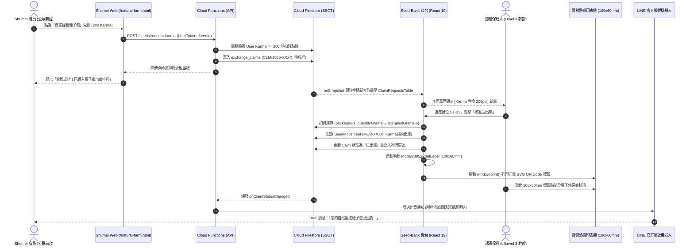
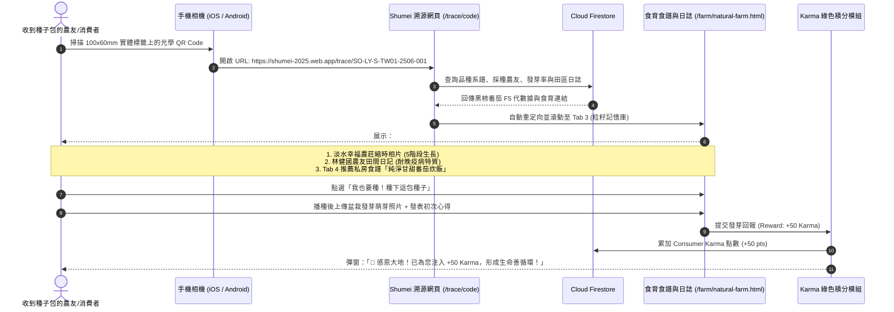
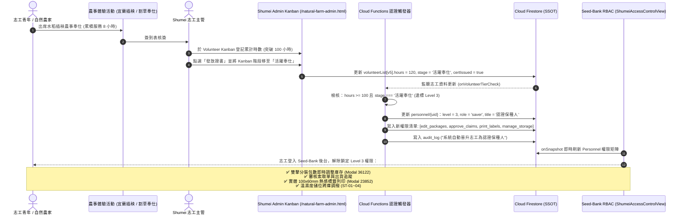

# Cross-Project Synergy & Technical Integration Handoff Report

**Project Pair**: Shumei (`/Users/tsaisungen/Sites/shumei`) ↔ Seed-Bank (`/Users/tsaisungen/Sites/Seed-Bank`)  
**Investigating Agent**: `teamwork_preview_explorer_integration`  
**Date**: 2026-09-18  
**Working Directory**: `/Users/tsaisungen/Sites/shumei/.agents/explorer_integration`  
**Deliverable Target**: `/Users/tsaisungen/Sites/shumei/.agents/explorer_integration/handoff.md`  

---

## 1. Observation

Direct code-level inspection and filesystem verification revealed the following concrete architectural facts:

### 1.1 Infrastructure & Deployment Unification
- **Shared Firebase Project ID**:
  - In `/Users/tsaisungen/Sites/shumei/.firebaserc`:
    ```json
    { "projects": { "default": "shumei-2025" } }
    ```
  - In `/Users/tsaisungen/Sites/Seed-Bank/.firebaserc`:
    ```json
    {
      "projects": { "default": "shumei-2025" },
      "targets": {
        "shumei-2025": { "hosting": { "seed-bank": ["shumei-seed-bank"] } }
      }
    }
    ```
  - Both applications exist in the same cloud project `shumei-2025`. Shumei is the default root host (`shumei-2025.web.app`), while Seed-Bank is deployed to the hosting target `shumei-seed-bank`.
  - Both share the capability to access the identical Cloud Firestore database (`projects/shumei-2025/databases/(default)`) and shared Firebase Authentication user identity pool.

### 1.2 Shumei Frontend & Community Architecture (`/Users/tsaisungen/Sites/shumei`)
- **Tech Stack**: Vanilla ES6+ JavaScript, Bootstrap 5, Tailwind CSS, FontAwesome 6, Firebase SDK 8.x/10.x, Service Worker PWA (`CACHE_NAME = 'shumei-pwa-v1.25'` in `/public/sw.js`).
- **Karma Gamification & Activity Redemption**:
  - `/public/js/natural-farm.js` (lines 392–432, 530–552, 683–692, 733–741):
    - Earns Karma: Bringing utensils (+40), Booking (+20), UGC review (+50), Quiz (+20), Rice adoption (+100).
    - In-memory/localStorage variable `userKarma` (default 380 pts).
    - Redemption method `redeemKarmaReward(rewardName, cost)`:
      - Line 531: Deducts `userKarma`, pushes voucher to `userVouchers` (`VOUCHER-${Date.now()}` with code `SHUMEI-REWARD-${random}`).
      - `/public/farm/natural-farm.html` line 549: Button `onclick="redeemKarmaReward('自家採種種子包', 200)"`.
- **Volunteer CRM & Certification**:
  - `/public/js/natural-farm-admin.js` (lines 92–98, 621–680):
    - `volunteerList`: Array of objects with `id`, `name`, `phone`, `stage` (`新申請`, `面談評估`, `已認證`, `活躍奉仕`), `skills`, `hours`, `note`.
    - Function `generateVolunteerCert(name, hours)` (lines 672–678) displays Modal `#volunteerCertModal` with certificate text: *"茲感謝 志工夥伴 [name] 君 累計無私奉獻時數達 [hours] 小時"*.
- **Food Edu & Seed Lineage (粒籽記憶庫)**:
  - `/public/farm/natural-farm.html` (lines 214–300, 310–380):
    - Tab 3 (粒籽記憶庫, Seed DNA Traceability): Features "自家採種越光米 (第12代)" (Nantou Puli) and "自家採種青皮黑豆 (第9代)" (Yilan Yuanshan), plus bucket rice adoption time-lapse photos (5 stages).
    - Tab 4 (節氣食育與純淨風味): Features seasonal recipes like "初夏旬味：自然農法無水甘甜番茄炊飯" using natural heirloom tomatoes and Koshihikari rice.
- **Physical Seed Exchange & Scanner**:
  - `/public/js/change.js` (lines 173–250, 284–332, 574–643):
    - Firestore collection `exchange_participants` tracking quotas (`quota`), carts (`selectedBags`), status (`pending`, `active`, `completed`).
    - Seed bag generator `generateSeedBagLabels` created ad-hoc codes `BAG-${partId}-B${i}`.
    - Scanner `Html5Qrcode` scanning bag codes and exit verification.

### 1.3 Seed-Bank Back-office Architecture (`/Users/tsaisungen/Sites/Seed-Bank`)
- **Tech Stack**: React 19.0.0, TypeScript 5.8, Tailwind CSS v4, Vite 6.2, Lucide React, `qrcode.react`.
- **Dual-View Architecture**:
  - `/src/App.tsx` (lines 38–46): Toggle between `'legacy'` (經典秀明後台 `#00664D`, TablePress #35090) and `'modern'` (次世代方舟).
- **NamingRule Formula Engine**:
  - `/src/utils/namingRule.ts` (lines 1–237):
    - Formula: `[Family]-[Variety]-[Method]-[Region]-[YYMM]-[Batch]` (14~18 characters).
    - 8 core families (CU, FA, PO, BR, SO, AS, MA, LA) + 6 extensions (AP, AM, AL, CO, PG, ZZ).
    - 4 farming methods: `S` (秀明), `N` (自然), `O` (有機), `C` (慣行).
    - Regional codes: Taiwan TW01~TW10 (TW01 North Coast, TW02 Yilan, TW06 Nantou, etc.), Japan JP01~JP47.
    - `generateSeedCode()`, `parseSeedCode()`, `validateSeedCode()`, `packagesToGrams()`, `gramsToPackages()`.
- **Thermal Label Print Engine (100mm x 60mm)**:
  - `/src/components/legacy_shumei/modals/Modal23852PrintLabel.tsx`:
    - Layout: Exactly 100mm x 60mm layout with `@media print` rules.
    - Embedded Vector SVG QR Code (`QRCodeSVG` from `qrcode.react`, size 92, level "M").
    - Prints generation (F{seed.generation} 代), crop name, scientific name, harvest year, harvester, region, net weight, NamingRule code, and slogan "無農藥．無肥料".
- **Physical Warehouse & Microclimate Storage**:
  - `/src/components/legacy_shumei/views/ShumeiWarehouseView.tsx` & `/src/types.ts`:
    - Tracks `StorageSpace`: `refrigerator` (4°C, 35% RH), `clay_pot` (14°C, 55% RH), `cellar` (18°C, 50% RH), `ambient`.
    - Tracks capacity, occupied grams, movements (`SeedMovement`), transfer transfers.
- **4-Tier RBAC Permission Matrix**:
  - `/src/components/legacy_shumei/views/ShumeiAccessControlView.tsx` (lines 17–27):
    - Level 1 (支持者 / Consumer): `view_seeds`, `claim_seeds`
    - Level 2 (耕作者 / Grower): `provide_seeds`
    - Level 3 (認證保種人 / Saver): `edit_packages`, `approve_claims`, `print_labels`, `manage_storage`
    - Level 4 (首席主事 / Admin): `edit_dcc`, `export_offgrid`
- **Offline Survival Package**:
  - `/src/utils.ts` (`generateSurvivalBundle`, lines 9–60):
    - Standalone single-file HTML bundle ("【緊急守護】自然農法種子庫 - 斷電備用查詢終端 OFFGRID VAC-1").
    - Zero network dependencies, embeds full serialized seed & storage database with standalone search UI.

---

## 2. Logic Chain

From these direct observations, we construct the step-by-step reasoning chain establishing technical feasibility, system roles, and concrete integration:

```
[Observation 1.1: Shared Firebase Project shumei-2025]
    ↓ (Inference 1)
Both systems can operate on a unified Firestore database and shared Firebase Auth identity without cross-domain auth barriers.

[Observation 1.2: Shumei has public engagement, Karma points, volunteer CRM, recipe storytelling]
[Observation 1.3: Seed-Bank has NamingRule 14-18 char engine, physical storage vaults, 100x60mm label printing, 4-tier RBAC]
    ↓ (Inference 2)
The systems form a natural complementary spectrum:
- Frontend: Shumei (Grassroots excitement, education, gamified Karma, volunteer training).
- Back-office: Seed-Bank (Botanical taxonomy, stock audit, thermal labeling, physical storage microclimate).

[Observation 1.2: redeemKarmaReward('自家採種種子包', 200) currently creates local mock voucher]
[Observation 1.3: Seed-Bank Modal66278Claim and TablePress35090 lack automated consumer point deduction]
    ↓ (Inference 3: Dimension 1)
Wiring Shumei's Karma redemption to trigger a Firestore claim transaction directly populates Seed-Bank's ClaimRequestsTable, allowing Level 3 stewards to approve, deduct physical grams/packages from specific storage vaults, and immediately trigger Modal23852PrintLabel (100x60mm) for dispatch.

[Observation 1.2: Shumei tracks volunteer stages (新申請->面談->已認證->活躍奉仕) and hours (0h->12h->36h->120h) with certificates]
[Observation 1.3: Seed-Bank enforces a 4-tier RBAC matrix (Level 1 Consumer -> Level 2 Grower -> Level 3 Saver -> Level 4 Admin)]
    ↓ (Inference 4: Dimension 2)
An exact 1-to-1 eligibility mapping exists:
- Volunteer 0h (新申請) = Level 1 (Consumer/Claimer).
- Volunteer 20h + Workshop = Level 2 (Grower/Provider).
- Volunteer 100h + Shumei Certificate = Level 3 (Certified Seed Saver / Claim Approver / Label Printer).
- System Directors = Level 4 (Chief Steward / DCC Admin).

[Observation 1.3: Modal23852PrintLabel encodes raw shumeiCode in QR]
[Observation 1.2: Shumei natural-farm.html Tab 3 & Tab 4 contain grower diaries, time-lapse photos, and recipes for specific varieties (e.g. 黑柿番茄, 越光米)]
    ↓ (Inference 5: Dimension 3)
Switching the QR code URL from raw text to `https://shumei-2025.web.app/trace/{shumeiCode}` transforms every physical seed packet into a dynamic food education portal: scanning opens the exact cultivar story, time-lapse gallery, and recipes, closing the loop by inviting planters to post reviews (+50 Karma).

[Observation 1.2: Shumei PWA Service Worker + Firestore enablePersistence()]
[Observation 1.3: Seed-Bank generateSurvivalBundle() offline standalone HTML]
    ↓ (Inference 6: Dimension 4)
Dual-layer resilience: Daily operations use Firestore real-time sync across both apps; disaster/grid-down scenarios leverage Seed-Bank's standalone HTML survival bundle enriched with Shumei's volunteer emergency contact roster and survival crop cultivation guidelines.
```

---

## 3. Detailed Technical Proposal & Specifications

### 3.1 Ecological Role Spectrum Matrix

| Dimension | Shumei (公眾參與及食農教育前台) | Seed-Bank (專業種源保存與庫存流通中後台) | Integrated Synergy (一體化協同價值) |
|---|---|---|---|
| **Core Role** | Public Portal, Community Hub, Youth Volunteer Incubator | Scientific Vault, Naming Engine, Microclimate Storage & Logistics | Complete Seed-to-Table Closed Loop |
| **Primary Audience** | Consumers, citizens, amateur gardeners, youth volunteers, festival attendees | Certified seed stewards (保種人), farm practitioners, chapter leads, DCC board | Seamless role progression from consumer to master steward |
| **Technology Stack** | Vanilla JS (ES6+), Bootstrap 5, Tailwind CSS, Firestore, Cloud Functions | React 19, TypeScript 5.8, Tailwind CSS v4, Vite 6, Vector SVG QR | Lightweight fast-loading mobile front + type-safe robust enterprise backoffice |
| **Data Granularity** | Macro-narrative: taste profile, seasonal terms, volunteer hours, Karma points | Micro-scientific: 14~18 char formula, gram weights, % germination, storage vault RH/temp | Story grounded in science; scientific germplasm popularized via stories |
| **Labeling / Barcode** | Optical camera QR scanning (`html5-qrcode`), ad-hoc bag IDs (`BAG-...`) | Vector SVG QR generation, strict NamingRule syntax, 100x60mm thermal printing | Standardized industrial labeling with instant consumer camera compatibility |
| **Security & Governance** | Open Google/Anonymous Auth, volunteer stage pipeline | Strict 4-Tier RBAC, DCC revision tracking, audit logs | Democratized participation under rigorous gatekeeping |
| **Offline Resilience** | PWA Service Worker (`shumei-pwa-v1.25`) + Firestore local persistence | Standalone single-file HTML survival bundle (`OFFGRID VAC-1`) + LocalStorage | Operational in partial network disruption and absolute grid-collapse |

---

### 3.2 The 4 Core Business Dimensions Specification

#### Dimension 1: Seed Inventory Deduction & Activity Redemption
1. **Karma Redemption Trigger**:
   - In Shumei (`/public/js/natural-farm.js`), clicking `redeemKarmaReward('自家採種種子包', 200)` issues a request to Cloud Function `redeemSeedPackageWithKarma`.
   - Function checks `users/{uid}.karma >= 200`, performs transactional deduction `karma -= 200`, and creates a document in Firestore collection `exchange_claims`:
     ```json
     {
       "claimId": "CLM-2026-0892",
       "userId": "usr_alpha88",
       "userName": "陳小明",
       "phone": "0912-345-678",
       "seedId": "S-001",
       "seedCode": "SO-LY-S-TW01-2506-001",
       "cropName": "黑柿自然留種番茄",
       "requestedPackages": 1,
       "gramsPerPackage": 5,
       "redeemType": "karma",
       "karmaDeducted": 200,
       "shippingAddress": "自取（台北總會農事市集）",
       "status": "pending_approval",
       "createdAt": "2026-09-18T02:00:00Z"
     }
     ```
2. **Seed-Bank Real-time Ingestion**:
   - Seed-Bank's `ClaimRequestsTable.tsx` listens via Firestore `onSnapshot('exchange_claims')`.
   - The claim appears at the top with a distinct `[Karma 兌換 200pts]` badge.
3. **Physical Storage Deduction & Movement Logging**:
   - Level 3 Steward clicks "核准出庫" -> Chooses storage space (e.g. `ST-01 A-1 種子低溫玻璃櫃`).
   - Transaction updates:
     - `seeds/{seedId}.packages -= 1`
     - `seeds/{seedId}.quantityGrams -= 5`
     - `storage_spaces/{storageId}.occupiedGrams -= 5`
     - Inserts `seed_movements`: `{ id: "MOV-904", seedId: "S-001", reason: "Karma兌換出庫 - CLM-2026-0892", operator: "林健國", timestamp: "..." }`
4. **Thermal Label Printing**:
   - Automatically opens `Modal23852PrintLabel.tsx` populated with `seed` data and claim barcode.
   - Steward clicks `window.print()` targeting 100mm x 60mm thermal sticker printer.
   - Sticker affixed to seed envelope; order status updated to `dispatched`.
   - Cloud Function triggers LINE Bot notification to user: *"您的自家採種番茄種子包已完成出庫備貨！"*.

#### Dimension 2: Member & Volunteer Certification Reciprocity
1. **Reciprocal Tier Matrix**:
   - **Level 1 (支持者 / Consumer)**: Any Shumei authenticated user. Can browse seed stocks and claim up to 3 bags/season or redeem via Karma.
   - **Level 2 (耕作者 / Grower)**: Shumei volunteer completing "面談評估" + at least 1 natural farming workshop (`training.html`) OR accumulating >= 20 volunteer hours. Unlocks Seed-Bank `Modal66281Provide` to submit harvested seeds and generate official NamingRule codes.
   - **Level 3 (認證保種人 / Saver)**: Shumei volunteer reaching "活躍奉仕" with >= 100 volunteer hours and awarded the Shumei Appreciation Certificate (`generateVolunteerCert`). Unlocks Seed-Bank inventory management, double-click package count adjustments (`Modal36122PackageEdit`), claim approvals, thermal label printing (`Modal23852PrintLabel`), and storage vault microclimate tuning.
   - **Level 4 (首席主事 / DCC Admin)**: Shumei Central Committee & Seed-Bank DCC administrators. Can modify coding taxonomies, SOP manuals, and generate full offline survival bundles.
2. **Automated Promotion Cloud Trigger**:
   - When Shumei admin moves volunteer stage to `活躍奉仕` or updates `hours >= 100` in `/public/farm/natural-farm-admin.html`:
   - Firestore trigger `onVolunteerUpdated` executes:
     ```javascript
     if (volunteer.hours >= 100 && volunteer.stage === '活躍奉仕') {
       await db.collection('personnel').doc(volunteer.userId).set({
         level: 3,
         role: 'saver',
         title: '認證保種人 (Shumei 資深奉仕)',
         permissions: ['view_seeds', 'claim_seeds', 'provide_seeds', 'edit_packages', 'approve_claims', 'print_labels', 'manage_storage']
       }, { merge: true });
     }
     ```

#### Dimension 3: Provenance & Food Education Bi-Directional Traffic
1. **Seed-Bank Package -> Shumei Story & Recipes**:
   - Seed-Bank's `Modal23852PrintLabel.tsx` QR generator is configured to encode:
     `https://shumei-2025.web.app/trace/SO-LY-S-TW01-2506-001`
   - Routing: `/public/farm/natural-farm.html?code=SO-LY-S-TW01-2506-001`
   - Consumer scans QR code on seed packet with smartphone:
     - Automatically switches to Tab 3 (粒籽記憶庫) and highlights "黑柿自然留種番茄 (第5代)".
     - Displays time-lapse photos of tomato field at Taiwan TW01 North Coast.
     - Displays grower log: *"歷經 2025 梅雨季高溫多溼，植株耐晚疫病，完全無化學噴劑，根系深達 1.2 米"*.
     - Prompts Tab 4 recipe: "初夏旬味：自然農法無水甘甜番茄炊飯".
     - Action button: *"我也要種！上傳我的發芽照片，賺取 +50 Karma 點數"*.
2. **Shumei Story -> Seed-Bank Lineage & Stock**:
   - In Shumei Tab 3, each crop card displays a live Seed-Bank badge:
     `[SO-LY-S-TW01-2506-001] 在庫 90 包 (450g) · 發芽率 92%`
   - Clicking badge triggers API call to `GET /seeds/genealogy?code=SO-LY-S-TW01-2506-001`, rendering an interactive generational lineage tree (F1 -> F2 -> ... -> F5) directly in Shumei's modal.

#### Dimension 4: Full Bi-Directional Sync Architecture & Offline Survival
1. **Single Source of Truth (SSOT) Topology**:
   - **Seed Biological & Inventory SSOT**: **Seed-Bank**. (Fields: `shumeiCode`, `germinationRate`, `storageLocationId`, `quantityGrams`, `packages`).
   - **Community, Food Edu, CRM & Karma SSOT**: **Shumei**. (Fields: `userKarma`, `volunteerHours`, `recipes`, `feedPosts`, `seminars`).
   - **Circulation Ledger**: **Shared Firestore Collection `exchange_claims`**.
2. **Client State Synchronization Strategy**:
   - Seed-Bank's `App.tsx` replaces isolated `localStorage` fallback with Firestore real-time listeners:
     `React 19 State` ↔ `Firestore onSnapshot` ↔ `IndexedDB Offline Cache`.
3. **Disaster Survival Bundle Compatibility**:
   - Seed-Bank's `generateSurvivalBundle(seeds, storage)` is upgraded to bundle:
     1. Complete Seed Inventory & Physical Vault Locations (Clay pots / Charcoal cellars).
     2. Shumei Level 3+ Certified Seed Stewards Contact Roster (Emergency regional seed distribution commanders).
     3. Shumei Core Cultivation Guides and Disaster Seed Saving SOPs.
   - Result: A 100% self-contained single `.html` file that boots without internet, power, or servers on any tablet/phone to direct post-disaster food sovereignty.

---

### 3.3 Concrete Integration Blueprint

#### 3.3.1 Cross-System Data Mapping Table

| Data Domain | Shumei Field (`shumei-2025` Firestore) | Seed-Bank Field (`src/types.ts`) | Type | Transformation / Sync Rule |
|---|---|---|---|---|
| **Seed ID** | `seed_dna.id` / `seedBags.id` | `Seed.id` | `string` | Canonical ID (e.g. `S-001`) |
| **Naming Code** | `seed_dna.shumeiCode` | `Seed.shumeiCode` | `string` | 14~18 char formula (`SO-LY-S-TW01-2506-001`), generated by `namingRule.ts` |
| **Crop Name** | `seed_dna.name` / `self-seed-name` | `Seed.name` | `string` | Common Chinese name (e.g. `黑柿自然留種番茄`) |
| **Variety** | `seed_dna.variety` / `self-seed-variety` | `Seed.variety` | `string` | Specific variety (e.g. `黑柿`) |
| **Scientific Name** | `seed_dna.scientificName` | `Seed.scientificName` | `string` | Botanical binomial (e.g. `Solanum lycopersicum`) |
| **Generation** | `seed_dna.generation` (e.g. "第12代") | `Seed.generation` | `number` | Integer generation count (e.g. `12`) |
| **Stock Packages** | `seed_dna.availablePackages` | `Seed.packages` | `number` | Real-time stock count (1 pkg = 5g) |
| **Stock Weight** | `seed_dna.totalGrams` | `Seed.quantityGrams` | `number` | Total stock in grams (`packages * 5`) |
| **Storage Vault** | `seed_dna.vaultName` | `Seed.storageLocationId` | `string` | Foreign key to `StorageSpace.id` (e.g. `ST-01`) |
| **Harvester** | `seed_dna.farmerName` | `Seed.harvester` | `string` | Grower name (e.g. `林健國 (阿國)`) |
| **Region** | `seed_dna.farmLocation` | `Seed.city` + `district` | `string` | Mapped to RegionCode (e.g. `TW01` 新北北海岸) |
| **User Identity** | `users.uid` / `auth.currentUser.uid` | `Personnel.id` | `string` | Shared Firebase Auth UID |
| **User Name** | `users.displayName` / `self-name` | `Personnel.name` | `string` | Full name |
| **Phone** | `users.phone` / `self-phone` | `Personnel.phone` | `string` | Mobile phone number |
| **Member Tier** | `volunteers.stage` + `volunteers.hours` | `Personnel.level` | `number (1-4)` | Calculated: 0h=L1, 20h=L2, 100h+Cert=L3, Admin=L4 |
| **System Role** | `users.role` | `Personnel.role` | `'admin'\|'saver'\|'grower'\|'consumer'` | Mapped: consumer(L1), grower(L2), saver(L3), admin(L4) |
| **Karma Points** | `users.karma` | *Virtual Field in Personnel* | `number` | Shumei authoritative; queried during claims |
| **Claim Seq** | `vouchers.code` / `claims.claimSeq` | `LegacyClaimRequest.claimSeq` | `string` | Formatted `CLM-YYYY-XXXX` |
| **Claim Status** | `claims.status` (`pending_approval`...) | `LegacyClaimRequest.status` | `enum` | `'待審核'\|'已核准'\|'已出貨'\|'已送達'\|'已結案'` |
| **Tracking Number**| `claims.trackingNumber` | `LegacyClaimRequest.trackingNumber` | `string` | Logistics tracking / parcel code |

---

#### 3.3.2 Proposed API Specifications

Base URL: `https://asia-east1-shumei-2025.cloudfunctions.net/api/v1`  
Authentication:  
- Client-to-API: `Authorization: Bearer <Firebase_ID_Token>`
- Microservice / Server-to-Server: `X-Shumei-API-Key: <secret_key>` + `X-Signature: HMAC_SHA256(payload)`

##### Endpoint 1: Redeem Seed Package via Karma
- **Route**: `POST /seeds/redeem-karma`
- **Auth**: Firebase Bearer Token (Registered user)
- **Request Body**:
  ```json
  {
    "seedId": "S-001",
    "requestedPackages": 1,
    "recipient": {
      "name": "陳小明",
      "phone": "0912-345-678",
      "address": "台北市北投區大屯自然園區1號",
      "notes": "請寄送自然農法推廣包"
    }
  }
  ```
- **Response (200 OK)**:
  ```json
  {
    "success": true,
    "claimId": "CLM-2026-0892",
    "deductedKarma": 200,
    "remainingKarma": 180,
    "seedCode": "SO-LY-S-TW01-2506-001",
    "status": "pending_approval",
    "message": "Karma 扣點成功，已建立出庫索取單，等待種子庫管理員核准出貨。"
  }
  ```
- **Error Codes**:
  - `400 Bad Request`: `INSUFFICIENT_STOCK` (種子庫已無足夠包數).
  - `403 Forbidden`: `INSUFFICIENT_KARMA` (Karma 點數不足 200 點).

##### Endpoint 2: Real-time Public Traceability Resolver (QR Scanner Destination)
- **Route**: `GET /seeds/trace/:shumeiCode`
- **Auth**: None (Public Open Endpoint)
- **Response (200 OK)**:
  ```json
  {
    "shumeiCode": "SO-LY-S-TW01-2506-001",
    "seed": {
      "name": "黑柿自然留種番茄",
      "variety": "黑柿",
      "scientificName": "Solanum lycopersicum",
      "generation": 5,
      "harvester": "林健國 (阿國)",
      "region": "TW01 新北北海岸 (淡水幸福農莊)",
      "farmingMethod": "秀明自然農法 (無農藥無肥料自家採種)",
      "germinationRate": 92,
      "testedDate": "2026-05"
    },
    "story": {
      "productionLog": "2025梅雨季高溫多溼，F4母株展現強韌抗晚疫病特徵，果實甘甜純淨。",
      "timelapsePhotos": [
        { "stage": "發芽期", "url": "https://images.shumei.org/sprout_01.jpg" },
        { "stage": "開花期", "url": "https://images.shumei.org/flower_01.jpg" },
        { "stage": "完熟採收", "url": "https://images.shumei.org/harvest_01.jpg" }
      ]
    },
    "recipes": [
      {
        "title": "初夏旬味：自然農法無水甘甜番茄炊飯",
        "author": "光之餐桌主廚",
        "ingredients": ["黑柿番茄2顆", "自家採種越光米2杯", "冷壓苦茶油1匙"],
        "url": "/farm/natural-farm.html#recipe-tomato-rice"
      }
    ]
  }
  ```

##### Endpoint 3: Approve Claim & Deduct Inventory
- **Route**: `POST /inventory/claims/:claimId/approve-dispatch`
- **Auth**: Firebase Bearer Token (Requires Seed-Bank Level 3+ Saver)
- **Request Body**:
  ```json
  {
    "storageLocationId": "ST-01",
    "trackingNumber": "POST-TW-88992211",
    "operatorId": "usr_steward_01"
  }
  ```
- **Response (200 OK)**:
  ```json
  {
    "success": true,
    "claimId": "CLM-2026-0892",
    "status": "dispatched",
    "storageUpdated": {
      "storageId": "ST-01",
      "deductedGrams": 5,
      "currentOccupiedGrams": 445
    },
    "labelPayload": {
      "shumeiCode": "SO-LY-S-TW01-2506-001",
      "qrUrl": "https://shumei-2025.web.app/trace/SO-LY-S-TW01-2506-001",
      "printFormat": "100x60mm_thermal"
    }
  }
  ```

---

#### 3.3.3 End-to-End Sequence Diagrams (Mermaid)

##### Sequence Diagram 1: Karma Points Redemption to Physical Storage Deduction & 100x60mm Thermal Printing



##### Sequence Diagram 2: Physical Seed Packet QR Scan to Food Edu & Community Storytelling Loop



##### Sequence Diagram 3: Volunteer Service Accumulation to Seed-Bank 4-Tier RBAC Auto-Elevation



---

### 3.4 Phased Implementation Roadmap & Risk Matrix

```
[Phase 1: 0~3 Months] 轻量連結與憑證互通 (Lightweight Coupling)
├── 1.1 統一 Firebase 專案配置 (共用 shumei-2025 專案、Auth 與 Firestore Rules)
├── 1.2 改造 Seed-Bank 100x60mm 標籤 QR Code 導流 URL (https://shumei-2025.web.app/trace/:code)
├── 1.3 實作 Cloud Function 基礎 Karma 兌換 API (POST /seeds/redeem-karma)
└── 1.4 Seed-Bank 索取清單 (ClaimRequestsTable) 增加即時 Karma 標記過濾

[Phase 2: 3~6 Months] 雙向深度串接與庫存連動 (Bi-Directional Deep Sync)
├── 2.1 Seed-Bank 狀態全面對接 Firestore (替換純 LocalStorage，實現跨設備即時同步)
├── 2.2 志工時數與 4 級 RBAC 權限自動晉升觸發器 (onVolunteerUpdated -> Personnel Level 1~4)
├── 2.3 Shumei 粒籽記憶庫即時掛載 Seed-Bank 長編碼、庫位與發芽率標籤
└── 2.4 Shumei 現場交換會 (change.html) 出口核銷與 Seed-Bank 庫存扣減聯動

[Phase 3: 6~12 Months] 一體化生態運作與極限生存網 (Unified Ecosystem & Mesh)
├── 3.1 升級極限離線生存包 (generateSurvivalBundle 整合志工名冊與食育生存指南)
├── 3.2 倉儲物聯網 (IoT) 溫濕度遙測數據自動回傳至 Shumei 官網農場大盤
└── 3.3 社群種籽封閉循環 (Seed-to-Table CSA 閉環：領種 -> 採收還種 -> Karma 增幅 -> 光之餐桌)
```

#### Risk Assessment & Mitigation Strategies

| # | Risk Description | Severity | Likelihood | Mitigation Strategy |
|---|---|---|---|---|
| **R1** | **並發扣減超賣 (Race Conditions on Low Stock)**<br/>多名 Shumei 會員同時以 Karma 點數兌換稀有種子，導致包數變為負數。 | **High** | Medium | 在 Cloud Functions 採用 **Firestore RunTransaction** 進行原子鎖定檢核；若 `packages < requested` 立即回滾並回退 Karma 點數。 |
| **R2** | **離線與在線狀態衝突 (Split-Brain Offline Sync)**<br/>偏遠農場或斷網時保種人在 LocalStorage 調撥庫位，上線時與雲端數據衝突。 | **High** | Medium | 實施 **CRDT / 向量時鐘 (Vector Clock)** 與「庫存扣減只增日誌 (Append-Only Movement Log)」策略，以最後寫入之出入庫紀錄流水號進行三方合併。 |
| **R3** | **熱感標籤在極端氣候褪色與相機掃描雜訊**<br/>農場強烈日照或高濕度導致 100x60mm 熱感紙反白或 QR 模糊無法識別。 | **Medium** | High | 1. 標籤材質規範必須採用「三防熱感紙 (防油防水防熱)」；<br/>2. QR Code 糾錯等級設為 `Level Q (25%)` 或 `Level H (30%)`；<br/>3. 標籤底部保留清晰人眼可讀之 14~18 碼明碼以供手動輸入。 |
| **R4** | **跨專案權限越權 (Privilege Escalation)**<br/>Shumei 前台一般用戶試圖發送偽造請求呼叫 Seed-Bank 後台調撥 API。 | **Critical** | Low | 在 Firestore Security Rules 與 Cloud Functions 中實施強制 RBAC 驗證：只有 `request.auth.token.level >= 3` 方可寫入庫存修改與儲位調撥。 |

---

## 4. Caveats

The following boundaries and assumptions apply to this investigation:
1. **Physical Printing Hardware Dependency**: Label preview (`Modal23852PrintLabel.tsx`) utilizes standard browser `window.print()` and CSS `@media print`. Actual thermal label generation requires an on-site thermal printer configured with 100mm x 60mm continuous/gap label roll.
2. **Current Seed-Bank State In-Memory/LocalStorage**: Seed-Bank currently persists primarily to browser `localStorage` (`OFFGRID_*`). While its `.firebaserc` already targets `shumei-2025`, full Firestore client SDK integration is a Phase 2 roadmap deliverable.
3. **No Code Modification Executed**: In strict accordance with the read-only Explorer role, zero modifications were made to the source repositories of either `/Users/tsaisungen/Sites/shumei` or `/Users/tsaisungen/Sites/Seed-Bank`.

---

## 5. Conclusion

1. **Strategic Feasibility**: The integration between Shumei and Seed-Bank is not only technically feasible but architecturally primed. Because both projects already share the same Firebase configuration (`shumei-2025`), they can seamlessly share database schemas, authentication, and cloud runtimes with zero infrastructure overhead.
2. **Clear Boundary Separation**:
   - **Shumei** is the **sensory public engagement frontend**, mobilizing citizens through gamified Karma points, farm work sessions, youth seminars, and seasonal culinary storytelling.
   - **Seed-Bank** is the **rigorous scientific germplasm back-office**, enforcing the 14~18 character NamingRule standard, microclimate physical vault tracking, 4-tier stewardship governance, and extreme grid-down disaster preparedness.
3. **Actionable Roadmap**: The 4 business dimensions (Inventory/Karma, Member/Volunteer, QR/Traceability, Full Sync/Offline) can be incrementally deployed across three distinct phases without disrupting existing operations, immediately maximizing project synergy.

---

## 6. Verification Method

To independently verify all findings and proposals documented in this report:

1. **Inspect Shared Firebase Configuration**:
   ```bash
   cat /Users/tsaisungen/Sites/shumei/.firebaserc
   cat /Users/tsaisungen/Sites/Seed-Bank/.firebaserc
   ```
   *Expected*: Both files specify `"default": "shumei-2025"`.

2. **Inspect Karma Redemption & Volunteer Cert in Shumei**:
   ```bash
   # Karma redemption & vouchers
   sed -n '530,555p' /Users/tsaisungen/Sites/shumei/public/js/natural-farm.js
   # Volunteer CRM & Appreciation Certificate
   sed -n '92,98p;670,680p' /Users/tsaisungen/Sites/shumei/public/js/natural-farm-admin.js
   ```
   *Expected*: Verifies `redeemKarmaReward` using 200 points for seed bags, and volunteer stages (`新申請`, `面談評估`, `已認證`, `活躍奉仕`) with 100+ hour certificates.

3. **Inspect NamingRule Engine, QR SVG & 100x60mm Label in Seed-Bank**:
   ```bash
   # NamingRule 14-18 formula
   sed -n '1,15p;155,185p' /Users/tsaisungen/Sites/Seed-Bank/src/utils/namingRule.ts
   # 100x60mm thermal label modal
   sed -n '55,128p' /Users/tsaisungen/Sites/Seed-Bank/src/components/legacy_shumei/modals/Modal23852PrintLabel.tsx
   ```
   *Expected*: Verifies 6-segment formula `[Family]-[Variety]-[Method]-[Region]-[YYMM]-[Batch]`, and 100mm x 60mm thermal print layout with embedded vector SVG QR code.

4. **Inspect Seed-Bank 4-Tier RBAC & Offline Survival Bundle**:
   ```bash
   # 4-tier permission matrix
   sed -n '17,28p' /Users/tsaisungen/Sites/Seed-Bank/src/components/legacy_shumei/views/ShumeiAccessControlView.tsx
   # Standalone survival bundle generator
   sed -n '1,30p' /Users/tsaisungen/Sites/Seed-Bank/src/utils.ts
   ```
   *Expected*: Verifies Level 1 Supporter to Level 4 Chief Steward permissions, and `generateSurvivalBundle` single-file offline HTML generation.
