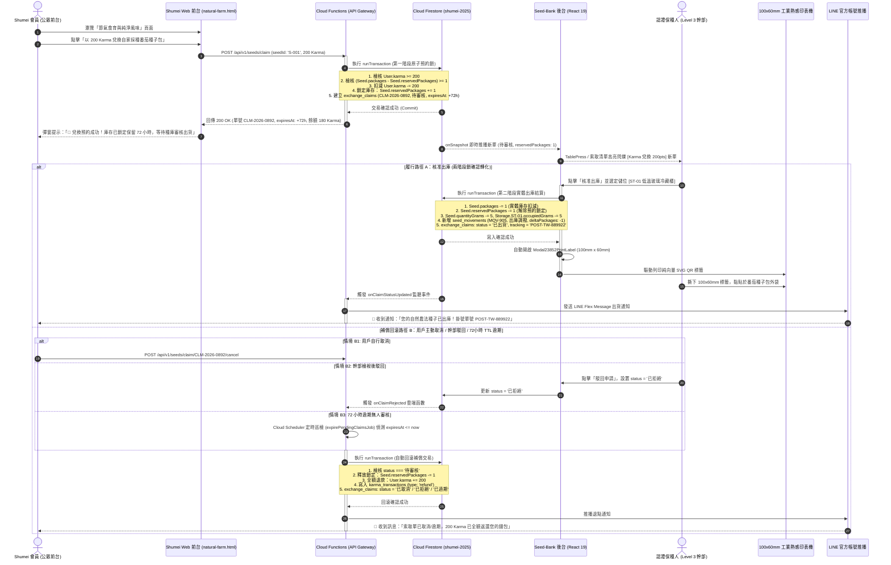

# Handoff Report: Architectural & Textual Remediation for Finding 1 & Finding 2

**Author**: `explorer_retry_1` (Explorer Subagent)  
**Recipient**: `parent` (Teamwork Preview Orchestrator / Lead Architect)  
**Target Document**: `/Users/tsaisungen/Sites/shumei/docs/SHUMEI_SEED_BANK_COLLABORATION.md`  
**Downstream Implementer**: `worker_m1`  
**Date**: 2026-09-18  
**Scope**: Exact remediation specifications for Finding 1 (Concurrency Race Condition & Inventory Reservation) and Finding 2 (Contradictory Split-Brain Protocol & Physical Deficit Handling).

---

## 1. Observation

Direct forensic inspection and cross-referencing of `/Users/tsaisungen/Sites/shumei/docs/SHUMEI_SEED_BANK_COLLABORATION.md`, `/Users/tsaisungen/Sites/shumei/.agents/reviewer_2/handoff.md`, `/Users/tsaisungen/Sites/shumei/PROJECT.md`, and `/Users/tsaisungen/Sites/Seed-Bank/src/types.ts` identified the following specific observations:

### 1.1 Finding 1: Concurrency Race Condition & Inventory Deduction Timing
- **Doc Lines 607–610 (Figure 2, Sequence Diagram 2)**:
  ```text
  CF->>DB: 執行 runTransaction (原子交易)
  Note over CF,DB: 1. 檢核 User.karma >= 200
                   2. 扣減 User.karma -= 200
                   3. 檢核 Seed.packages >= 1
                   4. 建立 exchange_claims (CLM-2026-0892, pending)
  ```
- **Doc Lines 618–620 (Figure 2, Sequence Diagram 2)**:
  ```text
  SB->>DB: 寫入出庫扣減更新：
  Note over SB,DB: 1. seeds/S-001: packages -= 1, quantityGrams -= 5
                   2. storage/ST-01: occupiedGrams -= 5
                   ...
  ```
- **Doc Lines 132–133 (Section 3.1.1)**:
  > 「3. 觸發 Cloud Function `POST /api/v1/seeds/claim`，同步在 Firestore 建立 `/exchange_claims/{claimId}` 交易單據，並凍結該會員 200 Karma 點數。」
- **Doc Lines 310–366 (Section 4.2.1)**:
  `POST /api/v1/seeds/claim` checks `packages >= requestedPackages` and deducts Karma, but does not decrement `packages` or record an in-flight hold.
- **Codebase Reality (`Seed-Bank/src/types.ts:20`)**:
  `Seed` interface only defines `packages?: number; gramsPerPackage?: number;`. There is no `reservedPackages` field anywhere in the data model or Firestore schema mapping.
- **Direct Vulnerability**:
  Between the moment a user claims a seed (Step 3 in Figure 2) and the moment a seed steward approves and physically ships it (Step 8 in Figure 2), `Seed.packages` remains unchanged. If 1 package remains, $N$ concurrent users can all successfully submit claims, deduct their Karma, and receive `200 OK`. When the steward reviews the claims hours or days later, only 1 user can receive the seed; the remaining $N-1$ users have lost their Karma with zero automated refund mechanism, no cancellation API, and no expiration TTL.

### 1.2 Finding 2: Contradictory Split-Brain Protocol & Physical Deficit Infeasibility
- **Doc Line 756 (Section 4.4.3, R2 Risk Mitigation)**:
  > 「採用 只增調撥日誌 (Append-Only Movement Log) 與版本向量（Vector Clock）架構。離線操作記錄為 SeedMovement 單據，連線時以單據流水號進行重播合併（Replay & Settle），而非覆寫實體絕對值。」
- **Doc Lines 490–496 (Section 4.2.4, `POST /api/v1/sync/seeds` Request Schema)**:
  ```json
  "outgoingPackageUpdates": [
    {
      "seedId": "S-001",
      "newPackages": 17,
      "clientVersion": 4
    }
  ]
  ```
- **Doc Line 521 (Section 4.2.4, Conflict Handling)**:
  > 「- 409 Conflict: 偵測到寫入衝突（伺服器端版本高於客戶端）。回傳伺服器端權威資料與衝突欄位清單，觸發客戶端三方合併。」
- **Direct Contradiction & Physical Flaw**:
  1. Section 4.4.3 explicitly prohibits overwriting absolute values, yet Section 4.2.4 introduces `outgoingPackageUpdates` with `newPackages: 17` (an absolute count).
  2. Software "three-way merge" cannot resolve physical inventory deficits. When an offline steward in a remote mountainous vault physically distributes 3 seed bags to visiting farmers (`-3`), while online users claim 4 bags (`-4`) against a physical stock of 5 bags, total physical demand (7) exceeds reality (5). Code cannot synthesize physical seeds out of thin air. The document lacks a concrete physical priority dispute resolution policy and compensation protocol.

---

## 2. Logic Chain

The reasoning from these direct observations to the remediations proceeds as follows:

```
[Observation 1.1: Asynchronous fulfillment gap without inventory lock]
  ├── Time gap between Claim creation (CF) and Fulfillment (Steward) leaves `packages` unadjusted.
  ├── Multiple concurrent transactions check `packages >= 1` and pass simultaneously.
  ├── Result: Overclaiming / overselling of scarce germplasm, points deducted without inventory.
  ├── Absence of `reservedPackages` makes atomic pre-allocation impossible.
  └── When fulfillment fails, no cancellation API, no TTL expiration, no automated refund exists.
                            │
                            ▼
[Remediation Logic 1: Two-Phase Inventory Lock + Rollback Protocol]
  ├── Step 1: Add `reservedPackages` to `Seed` model (Firestore & TypeScript).
  ├── Step 2: In `POST /api/v1/seeds/claim` transaction:
  │     Verify `(packages - reservedPackages) >= requestedPackages`.
  │     Atomically increment `reservedPackages += requestedPackages` and deduct Karma.
  │     Assign 72-hour `expiresAt` TTL.
  ├── Step 3: Fulfillment converts reservation to physical deduction:
  │     `packages -= requestedPackages`, `reservedPackages -= requestedPackages`.
  ├── Step 4: Cancellation API (`POST /api/v1/seeds/claim/{claimId}/cancel`) &
  │     Rejection Trigger (`onClaimRejected`) &
  │     72h Scheduled Sweeper (`expirePendingClaimsJob`):
  │     Execute atomic rollback: `reservedPackages -= requestedPackages`, `user.karma += 200`.
  └── Step 5: Update Sequence Diagram 2 to clearly depict both fulfillment and rollback branches.

                            │
                            ▼

[Observation 1.2: Split-Brain absolute count contradiction & unhandled physical deficits]
  ├── Section 4.4.3 mandates append-only logs, but Section 4.2.4 sends absolute `newPackages: 17`.
  ├── 409 Conflict client 3-way merge cannot resolve physical deficits where demand > physical stock.
  └── Lack of business rules for physical vs. digital precedence causes deadlock.
                            │
                            ▼
[Remediation Logic 2: Strictly Differential Movements + Physical Priority Precedence]
  ├── Step 1: Eliminate `outgoingPackageUpdates` and `newPackages` entirely from sync API.
  ├── Step 2: Enforce strictly differential `SeedMovement` schema (`deltaPackages: -N`, `deltaGrams: -G`).
  ├── Step 3: Server sequentially applies deltas (`packages += movement.deltaPackages`).
  ├── Step 4: Establish "Physical Reality Precedence" (物理現實優先原則):
  │     Offline physical distribution is irreversible and commits unconditionally.
  ├── Step 5: If physical deduction causes `packages < reservedPackages` (Physical Deficit):
  │     Online claims in '待審核' status are preempted in LIFO order.
  └── Step 6: Preempted online claims trigger automated compensation:
        100% Karma refund (200 pts) + 50 Bonus Karma apology credit + next-generation restock priority voucher.
```

---

## 3. Caveats

1. **Read-Only Scope**: This report defines the exact architectural specifications, replacement text blocks, schemas, and Mermaid diagram code. In compliance with the Teamwork Explorer role, no modifications were made directly to `docs/SHUMEI_SEED_BANK_COLLABORATION.md` or application source code.
2. **Execution Responsibility**: Applying the text replacements and diagram revisions is assigned to `worker_m1`.
3. **Decoupled Review Findings**: Findings 3 (IETF idempotency semantics), 4 (API security / custom claims / status enums), and 5 (DOM routing / Phase 0.5 roadmap) from `reviewer_2/handoff.md` are evaluated by companion subagents (`explorer_retry_2`, `explorer_retry_3`). The interface contracts formulated herein remain modular and 100% compatible with those companion remediations.
4. **Runtime Assumptions**: The proposed mechanisms assume Google Cloud Firestore v1/v2 distributed transactions (`runTransaction`), Cloud Functions v2 triggers, and Cloud Scheduler cron triggers (`*/15 * * * *`).

---

## 4. Conclusion: Exact Remediation Specifications

Below are the complete, production-grade text replacements, section insertions, schema models, and Mermaid diagrams for `worker_m1` to incorporate into `/Users/tsaisungen/Sites/shumei/docs/SHUMEI_SEED_BANK_COLLABORATION.md`.

---

### 4.1 Remediation for Finding 1: Concurrency Race Condition & Inventory Reservation

#### [Update 1.1] Section 2.3 (Line 95): `Seed` Model Definition
**Target**: `docs/SHUMEI_SEED_BANK_COLLABORATION.md`, Section 2.3 (2) Seed-Bank 記憶體與型別模型  
**Existing Text (Line 95)**:
```markdown
- `Seed`: 種子核心實體，嚴謹規範植物學特徵與風土歷程（`id`, `shumeiCode`, `name`, `scientificName`, `family`, `variety`, `generation`, `packages`, `quantityGrams`, `storageLocationId`, `harvester`, `harvestYear`, `germinationRate`, `climateAttributes`）。
```
**Replacement Text**:
```markdown
- `Seed`: 種子核心實體，嚴謹規範植物學特徵與風土歷程（`id`, `shumeiCode`, `name`, `scientificName`, `family`, `variety`, `generation`, `packages`, `reservedPackages`, `quantityGrams`, `storageLocationId`, `harvester`, `harvestYear`, `germinationRate`, `climateAttributes`）。其中 `reservedPackages`（預約凍結包數）作為分散式兩階段庫存鎖，線上索取單建立時原子累加，實體核准出庫時轉化扣減，訂單取消或過期時全額釋放。
```

---

#### [Update 1.2] Section 3.1.1 (Lines 128–133): Karma 200pt Claim Trigger & Two-Phase Lock
**Target**: `docs/SHUMEI_SEED_BANK_COLLABORATION.md`, Section 3.1.1  
**Existing Text (Lines 128–133)**:
```markdown
#### 3.1.1 業務觸發：Shumei Karma 200pt 兌換憑證
在 Shumei 前台 (`/public/farm/natural-farm.html` 與 `public/js/natural-farm.js`) 中，會員透過參加活動、自備環保餐具（+40 Karma）、發表三維感官心得（+50 Karma）累積點數。當點數達標時，點選「兌換自家採種種子包（200 Karma）」：
1. 前台調用函數 `redeemKarmaReward('自家採種種子包', 200)`。
2. 系統產生一組具備防偽隨機雜湊的憑證代碼：`SHUMEI-REWARD-${Math.random().toString(36).substring(2, 8).toUpperCase()}`（例如 `SHUMEI-REWARD-K9X2B7`）。
3. 觸發 Cloud Function `POST /api/v1/seeds/claim`，同步在 Firestore 建立 `/exchange_claims/{claimId}` 交易單據，並凍結該會員 200 Karma 點數。
```
**Replacement Text**:
```markdown
#### 3.1.1 業務觸發：Shumei Karma 200pt 兌換憑證與兩階段庫存預約鎖 (Two-Phase Lock)
在 Shumei 前台 (`/public/farm/natural-farm.html` 與 `public/js/natural-farm.js`) 中，會員透過參加活動、自備環保餐具（+40 Karma）、發表三維感官心得（+50 Karma）累積點數。當點數達標時，點選「兌換自家採種種子包（200 Karma）」：
1. 前台調用函數 `redeemKarmaReward('自家採種種子包', 200)`。
2. 系統產生一組具備防偽隨機雜湊的憑證代碼：`SHUMEI-REWARD-${Math.random().toString(36).substring(2, 8).toUpperCase()}`（例如 `SHUMEI-REWARD-K9X2B7`）。
3. 觸發 Cloud Function `POST /api/v1/seeds/claim`，執行**兩階段庫存預約鎖 (Two-Phase Inventory Reservation Lock)**：
   - **第一階段（預約凍結）**：在單一 Firestore `runTransaction` 內，同時驗證 `User.karma >= 200` 且 `(Seed.packages - Seed.reservedPackages) >= requestedPackages`。驗證通過後，原子扣減會員 200 Karma，並立即將種子實體之 `reservedPackages += requestedPackages` 進行鎖定，並寫入 `/exchange_claims/{claimId}`（狀態為 `待審核`，賦予 72 小時過期時限 `expiresAt = now + 72h`）。
   - **第二階段（履約轉化或自動回滾）**：
     - **核准出庫**：保種幹部實體揀貨並確認出庫時，執行 `Seed.packages -= requestedPackages` 且 `Seed.reservedPackages -= requestedPackages`，將預約鎖正式轉化為實體庫存扣減。
     - **取消/拒絕/逾期回滾**：若會員自行取消、幹部審核拒絕或超過 72 小時無人處理，系統自動觸發補償交易，全額退還 200 Karma 並執行 `Seed.reservedPackages -= requestedPackages`，完全杜絕超賣與點數充公爭端。
```

---

#### [Update 1.3] Section 3.1.3 (Lines 143–148): TablePress Column 4 Package Editor Interaction
**Target**: `docs/SHUMEI_SEED_BANK_COLLABORATION.md`, Section 3.1.3  
**Existing Text (Lines 143–148)**:
```markdown
#### 3.1.3 TablePress #35090 第 4 欄即時包數連動機制
在 Seed-Bank 的經典秀明後台 (`TablePress35090.tsx`) 中，TablePress #35090 具備 15 欄雙層分組表頭：
- 核心欄位：**第 4 欄「分裝包數 ✎」(`column-4`)** 支援主管左鍵雙擊 (`onDoubleClick`) 事件。
- 雙擊立即喚起快速修改彈窗 `Modal36122PackageEdit`。
- 當 Karma 兌換單自動扣減時，TablePress 第 4 欄之數字將透過 React State 與 Firestore 監聽即時遞減（例如從 `18` 變為 `17` 包），換算公克重（Column 5）同步自動從 `90g` 重新折算為 `85g`。
```
**Replacement Text**:
```markdown
#### 3.1.3 TablePress #35090 第 4 欄即時包數連動與預約狀態標示機制
在 Seed-Bank 的經典秀明後台 (`TablePress35090.tsx`) 中，TablePress #35090 具備 15 欄雙層分組表頭：
- 核心欄位：**第 4 欄「分裝包數 ✎」(`column-4`)** 支援主管左鍵雙擊 (`onDoubleClick`) 事件。
- 雙擊立即喚起快速修改彈窗 `Modal36122PackageEdit`。
- **實體在庫 vs 預約鎖定狀態連動**：
  - 第 4 欄所登記之數值為**實體在庫包數 (`Seed.packages`)**。
  - 當線上產生 Karma 索取單時，TablePress 透過 `onSnapshot` 監聽捕捉 `reservedPackages` 變更，在包數旁以警示徽章動態呈現（例如顯示 `18 包 (保留中: 1)`，淨可用包數計算為 $18 - 1 = 17$ 包），防止現場實體作業重複調撥。
  - 當幹部點選「核准出庫」時，系統執行二階段結算：`packages -= 1` 且 `reservedPackages -= 1`，TablePress 第 4 欄實體包數正式由 `18` 變為 `17`，換算公克重（Column 5）同步自 `90g` 自動重新折算為 `85g`。
  - 若該筆訂單遭拒絕或 72 小時逾期，`reservedPackages -= 1`，介面保留徽章立即消除，淨可用包數無縫回歸 18 包。
```

---

#### [Update 1.4] Section 4.1.1 (Lines 256–273): Seed Model Mapping Table Row
**Target**: `docs/SHUMEI_SEED_BANK_COLLABORATION.md`, Section 4.1.1 表格  
**Action**: 在表格「在庫分裝包數」下方插入新列「預約凍結包數」：
```markdown
| **預約凍結包數** | `seed_dna.reservedPackages` | `Seed.reservedPackages` | `number` | 共享狀態 | 預設 0。線上索取成功時原子累加 (`+requestedPackages`)；實體出庫時實扣轉化 (`-requestedPackages`)；取消/過期時全額釋放 (`-requestedPackages`)。淨可用包數公式為 `packages - reservedPackages`。 |
```

---

#### [Update 1.5] Section 4.1.3 (Lines 289–302): Claim Transaction Mapping Table Rows
**Target**: `docs/SHUMEI_SEED_BANK_COLLABORATION.md`, Section 4.1.3 表格  
**Action**: 更新 `status` 欄位並新增 `reservedPackages`, `expiresAt`, `refundStatus`, `cancelReason` 映射列：
```markdown
| 領域維度 | Shumei 欄位 (`exchange_claims`) | Seed-Bank 欄位 (`LegacyClaimRequest`) | 資料型別 | 權威 (SSOT) | 轉換與同步規則 |
|---|---|---|---|---|---|
| **索取單號流水號** | `claimId` | `claimSeq` | `string` | 共享規則 | 格式 `CLM-2026-XXXX` |
| **關聯種子長編碼** | `seedCode` | `seedCode` | `string` | Seed-Bank | NamingRule 14~18 碼 |
| **索取分裝包數** | `requestedPackages` | `requestedPackages` | `number` | Shumei | 預設為 1 包 |
| **預約鎖定包數** | `reservedPackages` | `reservedPackages` | `number` | Shumei | 記錄此單鎖定之包數（通常等於 `requestedPackages`） |
| **折算公克總重** | `totalGrams` | `totalGrams` | `number` | 共享規則 | `requestedPackages * 5` (g) |
| **兌換交易類型** | `redeemType` | `redeemType` | `string` | Shumei | `'karma'` (點數) / `'free'` (額度) / `'swap'` (以種換種) |
| **扣減 Karma 點數** | `karmaDeducted` | `karmaDeducted` | `number` | Shumei | 由伺服器依規則計算（固定 200 點/包），禁止前端竄改 |
| **扣點兌換憑證碼** | `voucherCode` | `voucherCode` | `string` | Shumei | 格式 `SHUMEI-REWARD-XXXXXX` |
| **實體扣庫儲位** | `allocatedStorageId` | `storageLocationId` | `string` | Seed-Bank | 出庫時保種人選定（`ST-01` ~ `ST-04`） |
| **單據流通狀態** | `status` | `status` | `enum` | 共享狀態 | `'待審核' → '已核准' → '已出貨' → '已送達' → '已結案' \| '已取消' \| '已拒絕' \| '已過期'` |
| **預約過期時限** | `expiresAt` | `expiresAt` | `string` | 共享規則 | 建立時設定 `createdAt + 72h` (RFC3339 格式) |
| **退點狀態** | `refundStatus` | `refundStatus` | `enum` | Shumei | `'none' \| 'refunded'`，取消或逾期退點後標註 |
| **取消/拒絕原因** | `cancelReason` | `cancelReason` | `string?` | 共享狀態 | 會員自行取消、幹部審核拒絕或逾期時記錄之理由 |
| **物流掛號單號** | `trackingNumber` | `trackingNumber` | `string` | Seed-Bank | 出貨時配發中華郵政單號（`POST-TW-XXXXXX`） |
```

---

#### [Update 1.6] Section 4.2.1 (Lines 310–366): `POST /api/v1/seeds/claim` Specification Update
**Target**: `docs/SHUMEI_SEED_BANK_COLLABORATION.md`, Section 4.2.1  
**Replacement Text**:
```markdown
#### 4.2.1 `POST /api/v1/seeds/claim`
- **功能說明**: Shumei 前台會員以 Karma 點數、免費額度或現場換種登記索取種子包。系統在單一 Firestore `runTransaction` 內實施**兩階段庫存預約鎖 (Two-Phase Inventory Reservation Lock)**：驗證可用庫存 `(packages - reservedPackages) >= requestedPackages`、扣減 Karma 點數、累加 `reservedPackages` 預約鎖定包數，並設定 72 小時過期時限 (`expiresAt`)。
- **認證要求**: `Authorization: Bearer <Firebase_ID_Token>` (用戶 UID 嚴格自認證 Context 提取，禁止前端傳遞竄改)
- **Request Headers**:
  - `Content-Type: application/json`
  - `Authorization: Bearer eyJhbGciOi...`
  - `X-Idempotency-Key: 9b1deb4d-3b7d-4bad-9bdd-2b0d7b3dcb6d` (必填 UUIDv4，保障重試等冪性)
- **Request Body Schema (JSON)**:
  ```json
  {
    "seedId": "S-001",
    "seedCode": "SO-LY-S-TW01-2506-001",
    "requestedPackages": 1,
    "redeemType": "karma",
    "voucherCode": "SHUMEI-REWARD-98A1B2",
    "fulfillmentMethod": "pickup",
    "shippingAddress": "台北市北投區大屯自然農場志工服務處",
    "recipient": {
      "name": "陳小明",
      "phone": "0912-345-678"
    }
  }
  ```
- **核心交易邏輯 (Transaction Logic)**:
  1. 檢核 `X-Idempotency-Key` 快取：若已成功處理過，回傳先前快取之 `200 OK` 資料。
  2. 啟動 Firestore `runTransaction`:
     - 讀取 `users/{uid}`，驗證 `karma >= (200 * requestedPackages)`。
     - 讀取 `seeds/{seedId}`，計算可用分裝包數：`availablePackages = (seed.packages || 0) - (seed.reservedPackages || 0)`。
     - 檢核可用庫存：若 `availablePackages < requestedPackages`，拋出 `ERR_INSUFFICIENT_STOCK` 終止交易。
     - 原子寫入：
       - `users/{uid}`: `karma -= (200 * requestedPackages)`
       - `seeds/{seedId}`: `reservedPackages = (seed.reservedPackages || 0) + requestedPackages`
       - 建立 `/exchange_claims/{claimId}`: 狀態為 `'待審核'`，寫入 `reservedPackages = requestedPackages`，計算 `expiresAt = now + 72h`。
       - 建立 `/users/{uid}/karma_transactions/{txId}`: 記錄扣點明細。
  3. 交易確認 Commit，回傳成功響應。
- **Response Schema (200 OK)**:
  ```json
  {
    "success": true,
    "data": {
      "claimId": "CLM-2026-0892",
      "claimSeq": "CLM-2026-0892",
      "userId": "usr_c87a29f1",
      "seedCode": "SO-LY-S-TW01-2506-001",
      "cropName": "黑柿自然留種番茄",
      "packages": 1,
      "reservedPackages": 1,
      "availablePackagesRemaining": 16,
      "allocatedBatch": "2506-001",
      "storageLocationId": "ST-01",
      "karmaRemaining": 180,
      "status": "待審核",
      "expiresAt": "2026-09-21T02:15:30Z",
      "labelReady": true,
      "createdAt": "2026-09-18T02:15:30Z"
    },
    "message": "索取預約成功，已鎖定 200 Karma 點數並預約保留分裝包 1 包，保留期 72 小時。"
  }
  ```
- **HTTP 狀態碼與錯誤處理 (Error Handling)**:
  - `200 OK`: 索取預約成功並鎖定庫存包數與 Karma 點數。
  - `400 Bad Request`: 
    - `ERR_MISSING_IDEMPOTENCY_KEY`: 未攜帶 `X-Idempotency-Key` 標頭。
    - `ERR_INVALID_PAYLOAD`: 參數格式錯誤。
    - `ERR_INSUFFICIENT_STOCK`: 在庫淨可用包數不足（`availablePackages < requestedPackages`）。
  - `401 Unauthorized`: 缺少 Token 或 Token 過期。
  - `422 Unprocessable Entity`: `ERR_INSUFFICIENT_KARMA`（會員 Karma 點數餘額不足 200 點）。
  - `404 Not Found`: `ERR_SEED_NOT_FOUND`（查無此種子代碼或已封存下架）。
  - `500 Internal Server Error`: `ERR_TRANSACTION_FAILED`（Firestore 並發交易重試失敗，自動全額回滾）。
```

---

#### [Update 1.7] New Section 4.2.1.1: Claim Cancellation, Rollback & 72-Hour Expiration Protocol
**Target**: `docs/SHUMEI_SEED_BANK_COLLABORATION.md`, 在 Section 4.2.1 之後插入  
**Content**:
```markdown
#### 4.2.1.1 索取取消、審核駁回與 72 小時自動過期回滾機制 (Cancellation, Rejection & 72h TTL Rollback Protocol)

為杜絕因庫存凍結導致珍稀種子被死鎖，系統制定了完整的三向補償交易回滾架構：

```
                    +------------------------------------+
                    |  索取單建立 (CLM-XXXX, 待審核)      |
                    |  - 扣除 200 Karma                  |
                    |  - Seed.reservedPackages += 1      |
                    |  - 設定 expiresAt = now + 72h      |
                    +-----------------+------------------+
                                      |
         +----------------------------+----------------------------+
         | (路徑 1: 正常履行)          | (路徑 2: 用戶自行取消)      | (路徑 3: 幹部拒絕 / 72h 逾期)
         v                            v                            v
+------------------+         +------------------+         +------------------+
| 保種幹部審核出庫 |         | 用戶呼叫取消 API |         | 幹部駁回 / TTL 巡檢 |
| packages -= 1    |         | POST .../cancel  |         | onClaimRejected  |
| reserved -= 1    |         |                  |         | expirePending    |
+--------+---------+         +--------+---------+         +--------+---------+
         |                            |                            |
         |                            +-------------+--------------+
         v                                          v
+------------------+                     +---------------------------+
| 產生出庫單與標籤 |                     | 執行原子回滾補償交易 (Rollback) |
| status: '已出貨' |                     | 1. Seed.reservedPackages -= 1 |
+------------------+                     | 2. User.karma += 200 (全額退) |
                                         | 3. 寫入退款帳本日誌 (refund) |
                                         | 4. status: '已取消' / '已過期' |
                                         +---------------------------+
```

##### 1. 索取取消 API 規格 (`POST /api/v1/seeds/claim/{claimId}/cancel`)
- **功能說明**: 在單據處於 `待審核` 狀態下，申請會員可主動撤回索取，或由保種幹部因故取消。
- **認證要求**: `Authorization: Bearer <Firebase_ID_Token>` (僅允許單據擁有者或 Level 3 保種幹部呼叫)
- **Request Headers**:
  - `Content-Type: application/json`
  - `Authorization: Bearer eyJhbGciOi...`
- **Request Body**:
  ```json
  {
    "reason": "用戶更換取貨梯次與地點"
  }
  ```
- **交易處理邏輯**:
  1. 讀取 `/exchange_claims/{claimId}`，驗證 `status === '待審核'`（若已核准或已出貨則回傳 `409 Conflict: ERR_CLAIM_ALREADY_PROCESSED` 禁止取消）。
  2. 執行 Firestore `runTransaction`:
     - 釋放預約鎖定庫存：`seeds/{seedId}.reservedPackages -= claim.requestedPackages`。
     - 返還扣除點數：`users/{userId}.karma += claim.karmaDeducted`。
     - 寫入 Karma 流水帳本：`users/{userId}/karma_transactions`: `{ type: 'refund_cancellation', delta: +claim.karmaDeducted, claimId }`。
     - 更新單據狀態：`status = '已取消'`, `refundStatus = 'refunded'`, `cancelledAt = now.toISOString()`, `cancelReason = reason`。
- **Response Schema (200 OK)**:
  ```json
  {
    "success": true,
    "data": {
      "claimId": "CLM-2026-0892",
      "status": "已取消",
      "refundedKarma": 200,
      "karmaBalance": 380,
      "releasedPackages": 1,
      "cancelledAt": "2026-09-18T04:20:00Z"
    },
    "message": "索取單已成功取消，200 Karma 已全數退回您的帳戶。"
  }
  ```

##### 2. 幹部審核駁回觸發器 (`onClaimRejected`)
當保種幹部在 Seed-Bank 後台檢視實體儲位發現種子外觀受損或發芽率疑慮，點擊「駁回申請」將單據狀態改為 `'已拒絕'` 時：
- Cloud Firestore Trigger `onDocumentUpdated('exchange_claims/{claimId}')` 自動捕獲狀態躍遷。
- 若 `before.status === '待審核'` 且 `after.status === '已拒絕'`：
  - 自動執行補償交易：`reservedPackages -= claim.requestedPackages`、`User.karma += claim.karmaDeducted`。
  - 將 `refundStatus` 設為 `'refunded'`。
  - 觸發 LINE Messaging API 推播通知用戶：「您索取之種子單 CLM-XXXX 因儲位品質複檢未通過而取消，200 Karma 已全額返還，請挑選其他優良種源。」

##### 3. 72 小時自動過期定時任務 (`expirePendingClaimsJob`)
為防止索取單長期滯留導致種子庫存虛耗凍結：
- 由 **Cloud Scheduler** 設定每 15 分鐘執行一次（Cron: `*/15 * * * *`）。
- 觸發 Cloud Function `expirePendingClaimsJob`，查詢條件：
  `exchange_claims.where('status', '==', '待審核').where('expiresAt', '<=', now.toISOString()).limit(50)`
- 批次對超時單據執行回滾：
  - 釋放鎖定包數：`Seed.reservedPackages -= claim.requestedPackages`。
  - 退還 Karma：`User.karma += claim.karmaDeducted`。
  - 更新單據狀態：`status = '已過期'`, `refundStatus = 'refunded'`, `cancelReason = '系統超過 72 小時未審核自動釋放'`。
  - 記錄日誌並發送推播通知用戶。
```

---

#### [Update 1.8] Section 4.3.2 (Lines 591–631): Revised Sequence Diagram 2 (Figure 2)
**Target**: `docs/SHUMEI_SEED_BANK_COLLABORATION.md`, Section 4.3.2  
**Replacement Text**:


---

#### [Update 1.9] Section 4.4.3 (Line 755): Risk Matrix R1 Update
**Target**: `docs/SHUMEI_SEED_BANK_COLLABORATION.md`, Section 4.4.3 R1  
**Replacement Text**:
```markdown
| **R1** | **並發扣減超賣與死鎖 (Concurrency Race Condition & Deadlock)**<br/>多位 Shumei 會員在熱門農事節氣同時以 Karma 兌換庫存僅剩 1 包之珍稀種子，導致庫存包數出現負數，或取消未履行時點數充公。 | **High (高)** | 中等 (Medium) | 實施**兩階段庫存預約鎖 (Two-Phase Inventory Lock)** 與**自動補償回滾**架構：<br/>1. 建立索取單時於 `runTransaction` 內驗證 `(packages - reservedPackages) >= requestedPackages`，並原子遞增 `reservedPackages += 1`，鎖定 72 小時；<br/>2. 幹部核准出庫時方扣除 `packages -= 1` 並歸零 `reservedPackages -= 1`；<br/>3. 支援 `POST /api/v1/seeds/claim/{claimId}/cancel` 端點、`onClaimRejected` 觸發器與 Cloud Scheduler 72 小時超時任務，自動回滾 `reservedPackages -= 1` 並 100% 全額返還 200 Karma。 |
```

---

### 4.2 Remediation for Finding 2: Contradictory Split-Brain Protocol & Physical Deficit Handling

#### [Update 2.1] Section 2.3 (Line 97): `SeedMovement` Model Definition
**Target**: `docs/SHUMEI_SEED_BANK_COLLABORATION.md`, Section 2.3 (2) Seed-Bank 記憶體與型別模型  
**Existing Text (Line 97)**:
```markdown
- `SeedMovement`: 實體庫內調撥單據（`id`, `seedId`, `fromStorageId`, `toStorageId`, `quantityGrams`, `reason`, `operator`, `timestamp`）。
```
**Replacement Text**:
```markdown
- `SeedMovement`: 實體庫內調撥單據（`id`, `seedId`, `seedCode`, `movementType`, `fromStorageId`, `toStorageId`, `deltaPackages`, `deltaGrams`, `reason`, `operator`, `deviceId`, `timestamp`, `offlineSignature`）。本單據為增量日誌的核心實體，嚴禁記錄絕對總量，一律以相對增減值（如 `deltaPackages: -3` 或 `+10`，`deltaGrams: -15` 或 `+50`）記錄，作為離線重播與分散式對帳之唯一依據。
```

---

#### [Update 2.2] Section 3.4.2 (Lines 240–243): Delta Sync Protocol Update
**Target**: `docs/SHUMEI_SEED_BANK_COLLABORATION.md`, Section 3.4.2  
**Replacement Text**:
```markdown
#### 3.4.2 純增量調撥日誌與分散式資料同步協定 (Differential Movement Delta Sync Protocol)
1. **線上即時同步**：Seed-Bank 改造現有純 `localStorage` 機制，引入 Firestore Web SDK 監聽器（`onSnapshot`）。當管理員在 TablePress 審核出庫或調撥儲位時，變更直寫 Firestore，並以樂觀更新（Optimistic UI）保證零延遲操作感。
2. **純增量調撥日誌 (Strict Append-Only Differential Movements)**：
   - **嚴禁覆寫實體絕對值**：跨端同步時，系統徹底廢除傳輸 `newPackages` 絕對包數的作法。所有離線或線上的庫存異動，必須具象化為帶有時間戳記與設備簽名的 `SeedMovement` 增量單據（例如 `deltaPackages: -3`）。
   - **時間向量與依序重播 (Deterministic Replay & Settlement)**：離線設備重新連線時，調用 `POST /api/v1/sync/seeds` 上傳離線單據日誌。伺服器依單據時間戳記遞增排序，依序套用原子相對增減，確保任何斷網重連情境下，運算狀態均具備收斂確定性。
   - **實體優先衝突裁決 (Physical Priority Principle)**：在實體分發量超過在線預約可用量之極端狀況下，系統恪遵「物理現實不可逆」準則，線下實體出庫無條件確認，超賣赤字由雲端啟動線上訂單之全額退點與紅利補償機制。
```

---

#### [Update 2.3] Section 4.2.4 (Lines 470–522): `POST /api/v1/sync/seeds` Specification
**Target**: `docs/SHUMEI_SEED_BANK_COLLABORATION.md`, Section 4.2.4  
**Replacement Text**:
```markdown
#### 4.2.4 `POST /api/v1/sync/seeds`
- **功能說明**: Seed-Bank 終端與 Shumei 雲端進行雙向增量複本同步。離線終端重新連線時，批次提交離線期間產生的純增量調撥日誌 (`SeedMovement`)，伺服器依序重播結算，並回傳雲端最新種子主檔增量與實體赤字裁決結果。
- **認證要求**: `Authorization: Bearer <Firebase_ID_Token>` (需具備 Level 3 保種人以上身分)
- **Request Headers**:
  - `Content-Type: application/json`
  - `Authorization: Bearer eyJhbGciOi...`
  - `X-Device-Id: DEVICE-ST03-OFFGRID`
- **Request Body Schema (JSON)**:
  ```json
  {
    "deviceId": "DEVICE-ST03-OFFGRID",
    "clientLastSyncTimestamp": "2026-09-18T00:00:00Z",
    "outgoingMovements": [
      {
        "id": "MOV-2026-0904",
        "seedId": "S-001",
        "seedCode": "SO-LY-S-TW01-2506-001",
        "movementType": "offline_distribution",
        "fromStorageId": "ST-01",
        "toStorageId": "EXTERNAL_FARMER",
        "deltaPackages": -3,
        "deltaGrams": -15,
        "reason": "偏遠山區避難小農現場實體領取",
        "operator": "林健國",
        "timestamp": "2026-09-18T01:30:00Z",
        "offlineSignature": "SIG_8F92A0B7C6E91D24"
      }
    ]
  }
  ```
  *(註：已徹底移除 `outgoingPackageUpdates` 與 `newPackages` 絕對包數欄位，全量改以相對增減值 `deltaPackages` 傳輸。)*

- **伺服器端重播與結算演算法 (Server-Side Replay & Settlement)**:
  1. 驗證設備 Token 與操作者權限 (`level >= 3`)。
  2. 針對 `outgoingMovements` 依 `timestamp` 遞增排序。
  3. 對每一筆調撥單執行原子冪等比對：若 `seed_movements/{id}` 已存在則略過（防止重複套用）。
  4. 在單一 Firestore 交易內：
     - 寫入 `seed_movements/{movement.id}`。
     - 更新實體庫存：`Seed.packages = FieldValue.increment(movement.deltaPackages)`、`Seed.quantityGrams = FieldValue.increment(movement.deltaGrams)`。
     - 釋放或調整實體儲位容量：`StorageSpace.occupiedGrams = FieldValue.increment(movement.deltaGrams)`。
     - **赤字偵測 (Deficit Check)**：結算後檢核該種子之實體包數是否低於線上未審核索取單之鎖定包數：
       若 `Seed.packages < Seed.reservedPackages`，觸發**實體優先衝突裁決協定**，自動搶佔受影響的線上訂單並執行退補。
  5. 產生同步響應，回傳最新結算時間點、實體赤字處理警告清單，以及客戶端所需之種子主檔 Delta。

- **Response Schema (200 OK)**:
  ```json
  {
    "success": true,
    "syncTimestamp": "2026-09-18T02:20:00Z",
    "appliedMovementsCount": 1,
    "physicalDeficitAlerts": [
      {
        "seedId": "S-001",
        "seedCode": "SO-LY-S-TW01-2506-001",
        "cropName": "黑柿自然留種番茄",
        "actualPackages": 2,
        "reservedPackages": 4,
        "deficitPackages": 2,
        "preemptedClaimIds": ["CLM-2026-0895", "CLM-2026-0896"],
        "resolutionPolicy": "PHYSICAL_PRIORITY_PREEMPTION",
        "compensationApplied": true
      }
    ],
    "deltaSeeds": [
      {
        "id": "S-001",
        "shumeiCode": "SO-LY-S-TW01-2506-001",
        "packages": 2,
        "reservedPackages": 2,
        "quantityGrams": 10,
        "version": 12,
        "updatedAt": "2026-09-18T02:20:00Z"
      },
      {
        "id": "S-002",
        "shumeiCode": "PO-RC139-S-TW04-2508-007",
        "packages": 45,
        "reservedPackages": 0,
        "quantityGrams": 225,
        "version": 9,
        "updatedAt": "2026-09-18T01:45:00Z"
      }
    ]
  }
  ```
- **HTTP 狀態碼與衝突處理**:
  - `200 OK`: 增量單據重播成功。若產生實體赤字，已自動透過實體優先裁決機制完成線上訂單搶佔退補，狀態已收斂。
  - `400 Bad Request`: 單據簽名無效、時間戳記格式錯誤或缺少必要欄位。
  - `401 Unauthorized`: 憑證無效或缺少 Token。
  - `403 Forbidden`: 設備或操作者未具備 Level 3 保種人寫入權限。
```

---

#### [Update 2.4] New Section 4.2.4.1: Physical Priority Dispute Resolution Policy
**Target**: `docs/SHUMEI_SEED_BANK_COLLABORATION.md`, 在 Section 4.2.4 之後插入  
**Content**:
```markdown
#### 4.2.4.1 實體優先衝突裁決協定 (Physical Priority Dispute Resolution Policy)

在偏遠深山儲備庫（如 `ST-03` 竹炭地窖）或極端災難斷網情境下，若線下保種幹部已實體發放種子，而線上平台在此期間亦接受了會員的預約兌換，連線重播後可能發生**實體物理赤字 (Physical Stock Deficit)**。傳統軟體的「三方合併 (3-Way Merge)」無法憑空產生物質，系統特此制定不可違背之實體優先仲裁規章：

##### 1. 核心公理：物理現實不可逆原則 (Axiom of Physical Reality Precedence)
> **「種子已入農友之手，土地生長不容中斷；物理物權絕對優先，雲端承擔補償責任。」**
實體發放具有不可撤銷性。系統禁止要求現場農民繳回種子，亦不得因雲端訂單而將線下調撥單判定為無效。所有線下提交之 `SeedMovement`（`deltaPackages < 0`）一律強制確認生效（Unconditional Commit）。

##### 2. 赤字判定公式與觸發條件
重播完成後，計算種子之淨物理可用量與預約鎖定量：
$$\text{Deficit} = \text{Seed.reservedPackages} - \text{Seed.packages}$$
- 若 $\text{Deficit} \le 0$：物理庫存足以支應所有線上預約，僅更新在庫包數，無需介入。
- 若 $\text{Deficit} > 0$：宣告發生實體物理赤字，赤字缺口為 $\text{Deficit}$ 包，即刻啟動自動化仲裁引擎。

##### 3. 線上索取單搶佔排序規則 (Preemption Selection Rules)
仲裁引擎針對該種子所有處於 `status === '待審核'` 的線上索取單進行篩選：
1. **LIFO 後進先出搶佔 (Last-In, First-Preempted)**：依照單據提交時間戳記（`createdAt`）倒序排序，最晚下單的會員索取單優先讓位給線下實體流通，確保較早排隊會員之權益。
2. **選取搶佔單據**：選出累計包數等於 $\text{Deficit}$ 之索取單清單（`preemptedClaimIds`）。

##### 4. 雙軌自動化補償機制 (Automated Compensation Workflow)
對所有被搶佔之線上單據，系統立即執行無縫補償交易：

```
                 [偵測到實體赤字 Deficit > 0]
                              │
                              ▼
           [選定被搶佔線上單據 (LIFO 後進先讓位)]
                              │
                              ▼
        +─────────────────────────────────────────────+
        │  執行原子補償交易 (Automated Compensation)   │
        ├─────────────────────────────────────────────┤
        │ 1. 100% 全額返還原始扣除點數 (+200 Karma)   │
        │ 2. 額外加碼道義禮遇金 (+50 Bonus Karma)     │
        │ 3. 釋放鎖定庫存: Seed.reservedPackages -= 1 │
        │ 4. 單據標記: status = '已結案 (實體優先補償)'│
        │ 5. 發送 LINE Flex Message 致歉與推薦替代種源│
        +─────────────────────────────────────────────+
                              │
                              ▼
               [提供次世代保種優先保留名額]
               (會員可一鍵登記 F-Gen+1 優先採收配發)
```

- **軌道一：全額退還 Karma + 50 點紅利道義補償 (Full Refund + Bonus Karma)**：
  - 立即將兌換消耗之 200 Karma 全數退回會員錢包。
  - 系統自動額外注入 **+50 Bonus Karma**（名目註記為「偏鄉緊急保種實體優先致歉補償」）。
  - 原子扣除該種子被佔用之 `Seed.reservedPackages`，使線上保留量調降至與實體在線包數相等。
  - 將索取單狀態變更為 `'已結案'`（次狀態標註 `subStatus: 'physical_preemption_refund'`）。
  - 透過 LINE 官方帳號發送 Flex Message，透明告知會員：「因偏遠地區實施天災緊急實體播種，您預約之【黑柿番茄】已優先讓位予現地耕作者。200 點 Karma 已全額返還，並額外致贈 50 點綠色道義積分以表敬意。」訊息內同時提供同科屬其他優質留種蔬菜之推薦連結。
- **軌道二：次世代優先採收兌換券 (Priority Restock Voucher)**：
  - 會員可於收到通知 24 小時內於 APP 點選「預約次代採收」。
  - 系統在文管中心建立保種等待券，於下一世代（F-Gen + 1）種子採收乾燥入庫時，優先保留配額並自動發貨，不再重複扣點。
```

---

#### [Update 2.5] Section 4.4.3 (Line 756): Risk Matrix R2 Update
**Target**: `docs/SHUMEI_SEED_BANK_COLLABORATION.md`, Section 4.4.3 R2  
**Replacement Text**:
```markdown
| **R2** | **離線與在線狀態衝突與實體赤字 (Split-Brain Offline Conflict & Physical Deficit)**<br/>在偏遠無訊號山區農場，保種人於離線狀態實體分發種子，回到有網路環境時與雲端新索取單產生版本衝突且實體庫存不足。 | **High (高)** | 中等 (Medium) | 1. **徹底廢除絕對值覆寫**：移除 `outgoingPackageUpdates` 與 `newPackages`，全量採用帶有時間戳記與設備簽章的**純增量調撥日誌 (`SeedMovement`, `deltaPackages: -N`)** 進行有序重播；<br/>2. **實施實體優先衝突裁決協定 (Physical Priority Dispute Resolution Policy)**：堅守「物理物權不可逆」公理，線下實體分發無條件確認生效；<br/>3. **線上受影響單據自動補償**：若重播後產生赤字（`packages < reservedPackages`），線上待審核訂單依 LIFO 啟動自動補償：**100% 全額返還 200 Karma + 贈予 50 點紅利補償點數**，並核發次世代優先採收兌換券。 |
```

---

## 5. Verification Method

To independently verify that the architectural remediations completely resolve Finding 1 and Finding 2 without introducing regressions or inconsistencies, the following verification commands and checks should be executed:

### 5.1 Text & Pattern Inspection Commands

1. **Verify `reservedPackages` is properly introduced across all relevant sections**:
   ```bash
   # Check occurrences of reservedPackages in the specification doc
   grep -n "reservedPackages" /Users/tsaisungen/Sites/shumei/docs/SHUMEI_SEED_BANK_COLLABORATION.md
   # Should match in Section 2.3, 3.1.1, 3.1.3, 4.1.1, 4.1.3, 4.2.1, 4.2.1.1, 4.3.2 (Figure 2), and 4.4.3 (R1)
   ```

2. **Verify complete elimination of `outgoingPackageUpdates` and `newPackages`**:
   ```bash
   # Must return 0 matches
   grep -n "outgoingPackageUpdates" /Users/tsaisungen/Sites/shumei/docs/SHUMEI_SEED_BANK_COLLABORATION.md
   grep -n "newPackages" /Users/tsaisungen/Sites/shumei/docs/SHUMEI_SEED_BANK_COLLABORATION.md
   grep -n "appliedPackageUpdatesCount" /Users/tsaisungen/Sites/shumei/docs/SHUMEI_SEED_BANK_COLLABORATION.md
   ```

3. **Verify presence of Physical Priority Dispute Resolution Policy**:
   ```bash
   grep -n "實體優先衝突裁決" /Users/tsaisungen/Sites/shumei/docs/SHUMEI_SEED_BANK_COLLABORATION.md
   grep -n "Physical Priority" /Users/tsaisungen/Sites/shumei/docs/SHUMEI_SEED_BANK_COLLABORATION.md
   grep -n "Bonus Karma" /Users/tsaisungen/Sites/shumei/docs/SHUMEI_SEED_BANK_COLLABORATION.md
   ```

4. **Verify cancellation, rejection rollback, and 72-hour TTL specifications**:
   ```bash
   grep -n "POST /api/v1/seeds/claim/{claimId}/cancel" /Users/tsaisungen/Sites/shumei/docs/SHUMEI_SEED_BANK_COLLABORATION.md
   grep -n "onClaimRejected" /Users/tsaisungen/Sites/shumei/docs/SHUMEI_SEED_BANK_COLLABORATION.md
   grep -n "72" /Users/tsaisungen/Sites/shumei/docs/SHUMEI_SEED_BANK_COLLABORATION.md
   grep -n "expirePendingClaimsJob" /Users/tsaisungen/Sites/shumei/docs/SHUMEI_SEED_BANK_COLLABORATION.md
   ```

5. **Verify Mermaid Diagram syntax integrity**:
   Copy the revised Sequence Diagram 2 code from Section 4.1 (Update 1.8) into the Mermaid Live Editor or run `npx @mermaid-js/mermaid-cli` to ensure zero syntax errors.

### 5.2 Scenario Walkthrough & Invalidation Conditions

| Test Scenario | Expected Outcome | Invalidation Condition (Remediation Fails If) |
|---|---|---|
| **Scenario 1: Concurrency Race Condition**<br/>1 package left (`packages: 1, reservedPackages: 0`). User A & User B simultaneously claim seed. | User A's transaction succeeds: `reservedPackages` becomes 1. User B's transaction reads `availablePackages = 1 - 1 = 0`, aborts with `ERR_INSUFFICIENT_STOCK`. User B's Karma is not deducted. | User B's transaction succeeds, or `reservedPackages` is not checked atomically inside `runTransaction`. |
| **Scenario 2: Claim Expiration TTL**<br/>User A claims seed. Steward does not review within 72 hours. | At $t = 72\text{h} + 1\text{m}$, `expirePendingClaimsJob` executes: `reservedPackages` decremented from 1 to 0, 200 Karma returned to User A, status becomes `'已過期'`. | Claim remains in `'待審核'` forever, or inventory remains locked indefinitely. |
| **Scenario 3: Offline Physical Deficit**<br/>Vault has 5 packages. Offline steward distributes 3 packages (`deltaPackages: -3`). Online platform reserves 4 packages (`reservedPackages: 4`). | Sync API replays delta: physical stock becomes $5 - 3 = 2$. Deficit is $4 - 2 = 2$. Physical distribution is committed. The 2 newest online claims are preempted, receiving 100% refund (200 Karma) + 50 Bonus Karma. `reservedPackages` drops to 2. | Server returns 409 Conflict demanding client merge, or offline physical distribution is rejected, or online users receive no compensation. |

