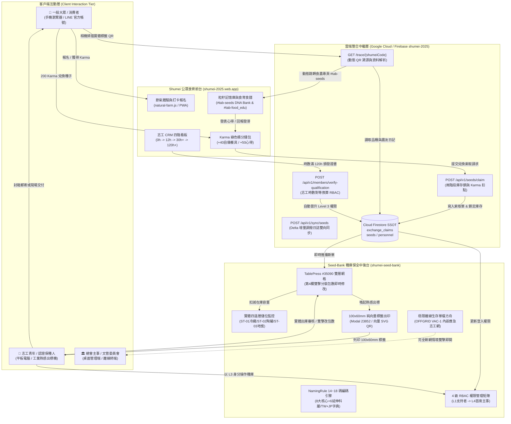
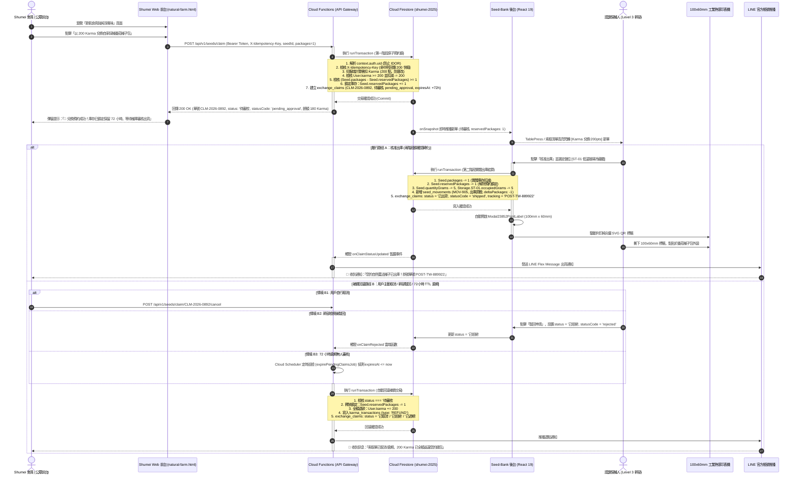
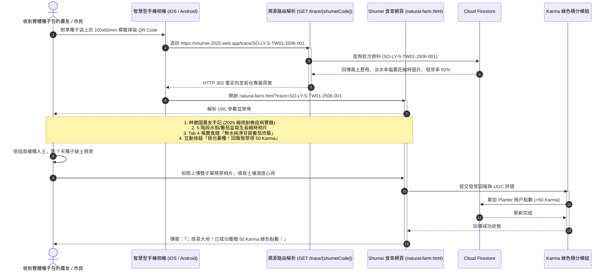
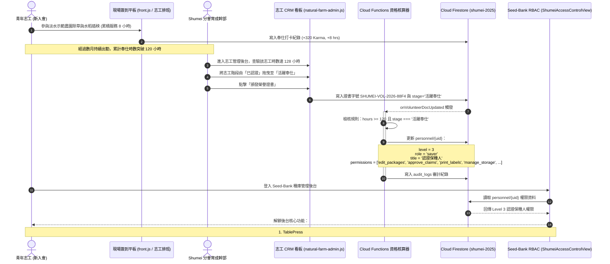

# 秀明自然農法生態體系跨專案整合技術規格與合作藍圖
## Shumei ↔ Seed-Bank Cross-Project Collaboration Blueprint & Technical Specification

- **專案對稱**: 
  - **公眾前台**: Shumei 自然農法推廣與活動社群平台 (`/Users/tsaisungen/Sites/shumei`, 預設 Host: `shumei-2025.web.app`)
  - **中後台系統**: Seed-Bank 秀明自家採種種子庫管理系統 (`/Users/tsaisungen/Sites/Seed-Bank`, 託管目標: `shumei-seed-bank`)
- **共同基礎設施**: Google Cloud / Firebase 專案 `shumei-2025`
- **文件版本**: v1.1.0 (Hardened Enterprise Architecture Release)
- **維護機構**: 秀明自然農法協會資訊委員會、種子方舟技術小組、文管中心 (DCC)
- **發布日期**: 2026-09-18

---

## 第壹章 執行摘要與戰略願景 (Executive Summary & Strategic Vision)

### 1.1 背景與願景：連結公眾食農推廣與專業種源保全
秀明自然農法（Shumei Natural Agriculture）承襲岡田茂吉先生之哲學核心——「尊重自然、順應自然，不施任何農藥與肥料，堅持自家採種」。在氣候變遷劇烈、極端乾旱與超強降雨常態化的今日，健康且具備在地適應性的自然農法種子，不僅是農業生產的起點，更是維繫人類糧食安全與區域生態韌性的關鍵戰略資產。

目前在數位生態系中，存在兩個高度互補卻運作獨立的系統：
1. **Shumei 平台 (`/Users/tsaisungen/Sites/shumei`)**：長年深耕公眾活動參與、食農教育體驗、青年志工培訓、農場打工換宿與節氣飲食推廣，建立以 Karma 綠色公民點數為激勵核心的社群生態。
2. **Seed-Bank 系統 (`/Users/tsaisungen/Sites/Seed-Bank`)**：以植物學分類與遺傳保存為基石，開發出嚴謹的 14~18 碼 NamingRule 種子編碼引擎、實體多溫層物理倉儲監控、TablePress #35090 雙層網格管理、100x60mm 純向量熱感標籤出印，以及應對電網全面癱瘓的單檔離線方舟。

本藍圖之戰略核心，在於打破「公眾社群」與「專業種庫」之間的數位孤島，運用雙方共用同一個 Firebase 雲端專案（`shumei-2025`）的天然優勢，構建出**「公眾食育動員前台」與「種源科研保全中後台」無縫融合的一體化生態網絡**。

```
+---------------------------------------------------------------------------------------------------+
|                                 自然農法生態系雙向循環架構圖                                      |
+---------------------------------------------------------------------------------------------------+
|  【公眾參與與食育前台】Shumei (shumei-2025.web.app)                                               |
|  - 節氣體驗報名與自備餐具 (+40 Karma)                                                              |
|  - 24 節氣農友田間日記與感官 UGC 評價 (+50 Karma)                                                 |
|  - 青年志工奉仕育成管線 (0h -> 12h -> 30h+ -> 120h+ 證書)                                         |
|  - 粒籽記憶庫 (DNA Bank) 與盆栽水稻認養縮時攝影 (#tab-seeds)                                       |
+-------------------------------------------------+-------------------------------------------------+
                                                  | 雙向數據連動 (Cloud Functions v2 & Firestore)
                                                  v
+---------------------------------------------------------------------------------------------------+
|  【專業種源與倉儲中後台】Seed-Bank (shumei-seed-bank)                                             |
|  - 14~18 碼 NamingRule 植物學與風土編碼引擎                                                       |
|  - 四大實體倉儲空間溫濕度調控 (電網冷藏 ST-01 / 蒸發陶罐 ST-02 / 竹炭地窖 ST-03 / 常溫 ST-04)   |
|  - TablePress #35090 雙層網格與 Column 4 雙擊分裝包數即時扣減 (實體在庫 vs 預約保留標記)           |
|  - 100x60mm 工業級純向量 SVG QR Code 熱感標籤印製 (指向 https://shumei-2025.web.app/trace/...)  |
|  - 4 級 RBAC 權限管理矩陣 (Level 1 支持者 -> Level 2 生產者 -> Level 3 保種人 -> Level 4 首席主事) |
|  - 極限斷網單檔 HTML 離線方舟 (OFFGRID VAC-1 內嵌 Shumei 應急保種志工網絡)                       |
+---------------------------------------------------------------------------------------------------+
```

### 1.2 核心整合指標與目標 (Key Integration Objectives)
- **庫存兩階段預約防超賣 (Two-Phase Inventory Lock & Zero-Overclaiming)**：公眾於前台以 200 Karma 點數兌換「自家採種種子包」時，系統在 Firestore 原子交易內檢核淨可用包數 `(packages - reservedPackages) >= requestedPackages` 並鎖定預約，實體出庫時扣減實體在庫，杜絕並發超賣與點數充公爭端。
- **身分資歷 1:1 對等晉升 (1:1 Credential Reciprocity)**：Shumei 志工達成 120 小時奉仕並獲得 `SHUMEI-VOL-2026-XXXX` 證書者，經由 Firebase Auth Token 驗證 Custom Claims `seedBankLevel >= 3`，自動解鎖 Level 3（認證保種人）實體倉儲調撥與審核出庫權限。
- **全生命週期光學溯源 (Full Lifecycle Traceability)**：實體種子外袋 100x60mm 熱感標籤由 `qrcode.react` (`QRCodeSVG`) 產製純向量 SVG QR Code，完整編碼動態 URL `https://shumei-2025.web.app/trace/{shumeiCode}`，手機掃描直達 Shumei 前台 `#tab-seeds`，自動喚起路由解析與農友產地縮時照片，形成「領種 → 播種 → 回報發芽 (+50 Karma) → 採收還種」的生命善循環。
- **純增量調撥與實體優先裁決 (Strict Differential Sync & Physical Priority)**：離線設備重新連線時，以純增量 `SeedMovement`（`deltaPackages: -N`）進行依序重播，徹底廢除絕對值覆寫；若重播產生實體赤字，恪遵「物理現實優先原則」，線下實體分發無條件生效，線上預約單啟動 100% 全額退款 + 50 Bonus Karma 道義補償。
- **離線極限韌性相容 (Extreme Offline Resilience)**：支援在電網崩潰與全島斷網環境下，透過單檔離線方舟（`generateSurvivalBundle`）離線查詢庫位，並內載 Shumei 認證保種幹部緊急動員通訊錄。

---

## 第貳章 雙專案技術架構與功能矩陣全景對比 (R1)

### 2.1 基礎設施與雲端環境拓撲
兩專案在物理架構上具備天生的親和性，經由代碼庫查驗，雙方設定均原生指向同一個 Google Cloud / Firebase 專案實體：
- `shumei/.firebaserc`: `{"projects": {"default": "shumei-2025"}}`
- `Seed-Bank/.firebaserc`: `{"projects": {"default": "shumei-2025"}, "targets": {"shumei-2025": {"hosting": {"seed-bank": ["shumei-seed-bank"]}}}}`

這項關鍵特徵確立了跨系統架構毋須建構複雜的第三方跨域認證通道，能直接在 Google Cloud IAM 與 Cloud Firestore 安全規則內，以原生身分（Identity Pool）與服務端權限互通。

### 2.2 技術堆疊三維全景對比矩陣

| 維度 (Dimension) | Shumei 自然農法公眾社群平台 (`shumei`) | Seed-Bank 種子庫管理系統 (`Seed-Bank`) | 整合協同效益與技術互補 |
|---|---|---|---|
| **核心定位** | 公眾參與、食農教育、志工動員、綠色積分生態 | 專業種源保全、風土編碼、多溫層倉儲、物資調撥流通 | 建構「公眾教育前台＋專業科研後台」一體化閉環 |
| **主要客群** | 一般消費者、農事體驗者、青年志工、廣大信徒 | 認證保種農友、育種專家、分會物流幹部、文管主事 | 導引一般市民透過志工晉升階梯轉化為專業保種人 |
| **前端框架** | 原生 JavaScript (ES6+ Vanilla JS) 輕量架構 | React 19.0.0 最新並行渲染架構 (Hooks, Concurrent) | 前台超快首屏載入；中後台高度組件化、型別安全 |
| **語言規格** | ECMAScript 2022+ (純 JS，動態型別) | TypeScript 5.8 嚴格靜態型別 (`strict: true`) | 後台強型別保護資料庫模型；前台提供極致相容性 |
| **構建工具** | 原生靜態資源託管 (零 Bundler 依賴) | Vite 6.2.3 現代化極速熱更新打包器 | 後台具備模組化代碼分割與樹搖優化 (Tree-shaking) |
| **樣式引擎** | Bootstrap 5.1.1 + Glassmorphism 毛玻璃自訂 CSS | Tailwind CSS v4 (`@tailwindcss/vite`) 實用類別優先 | 前台溫馨流動、感官豐富；後台緊湊高密度儀表板 |
| **狀態管理** | 模組全域變數、`localStorage` (遷移至雲端)、DOM 綁定 | React 19 集中狀態 (`App.tsx`) + `localStorage` 快取 | 經由 Phase 0.5 雲端化後，透過 Firestore Realtime Listener 統一兩端狀態 |
| **本地資料庫** | Firestore Local Persistence (`enablePersistence()`) | `localStorage` (前綴 `OFFGRID_*`) 序列化快取 | 提供雙重快取保護，並具備 IndexedDB 本地檢索能力 |
| **雲端資料庫** | Cloud Firestore (`shumei-2025`, 跨庫 `gantt-craft-2026`) | 預備對接 Cloud Firestore (`shumei-2025`) | 共同讀寫同一 Firestore 實例，省去跨庫搬移延遲 |
| **身分驗證** | Firebase Auth (Google OAuth, 匿名遊客) + 認領驗證 | 4 級角色權限 (RBAC: Level 1~4) + Firebase Auth | 統一以 Firebase UID 為外鍵，透過 Custom Claims 傳遞 `seedBankLevel` |
| **條碼與辨識** | 光學相機即時掃描器 (`html5-qrcode` v2.3.8) | 純向量 SVG QR Code 生成器 (`qrcode.react` v4.2.0) | 後台產製純向量高容錯 QR，前台相機 100% 瞬間解碼 |
| **實體出印** | 瀏覽器預設列印對話框、ExcelJS 報表導出 | 100mm × 60mm 工業級熱感標籤引擎 (`Modal23852`) | 後台提供精準物理開版，無縫貼附標準種子信封袋 |
| **微服務後端** | Cloud Functions v2 (Node.js 20, Pub/Sub, Gemini) | 原生輕量整合層 / 預備 Cloud Functions 端點 | 複用 Shumei 既有 Pub/Sub 與 LINE Bot 非同步架構 |
| **災難生存** | PWA Service Worker (`shumei-pwa-v1.25`) 離線快取 | 單檔 HTML 獨立方舟 (`generateSurvivalBundle`) | 斷網時仍保有種庫完整清單與緊急聯絡網絡 |

### 2.3 資料模型與儲存架構深度對比

#### (1) Shumei 現行 Firestore 資料模型 (代表性集合)
- `/member/{joinDateKey}`: 青年與幹部核心通訊錄（欄位包含 `name`, `guide`, `sewajin`, `born`, `join`, `post`, `connect`, `part`）。
- `/allowed_users/{email}`: 身分白名單與帳號綁定（欄位包含 `allowDirectLogin`, `linkedMemberId`, `linkedName`, `lastLogin`）。
- `/exchange_participants/{ticketId}`: 種子交換現場票券（欄位包含 `name`, `phone`, `seedName`, `variety`, `weight`, `quota`, `selectedBags`, `status: 'pending'|'active'|'completed'`）。
- `/natural_events/{eventId}` & `/natural_bookings/{token}`: 公眾預約與報名憑證（Token 格式 `SHUMEI-NF-${timestamp36}-${rand4}`，含 `bringUtensilsBonus`, `checkedIn`, `paymentStatus`）。
- `/seminars/{seminarId}`: 座談紀錄與靈性啟發反饋（透過 Gemini 2.5 Flash 自動解析結構化寫入）。
- `/users/{uid}/karma`: (Phase 0.5 雲端真理源遷移) 記錄會員點數餘額 `{ balance: number, updatedAt: Timestamp }`。
- `/users/{uid}/karma_transactions/{txId}`: (Phase 0.5 雲端不可變流水帳本) 記錄點數變動 `{ txId, amount, type: 'EARN'|'REDEEM'|'REFUND', reason, referenceId, createdAt, balanceAfter }`。
- `/volunteers/{uid}`: (Phase 0.5 雲端志工 CRM 真理源) 記錄志工培訓檔案 `{ uid, name, phone, stage, hours, certificateId, certificateIssuedAt, updatedAt }`。

#### (2) Seed-Bank 記憶體與型別模型 (`src/types.ts`)
- `Seed`: 種子核心實體，嚴謹規範植物學特徵與風土歷程（`id`, `shumeiCode`, `name`, `scientificName`, `family`, `variety`, `generation`, `packages`, `reservedPackages`, `quantityGrams`, `storageLocationId`, `harvester`, `harvestYear`, `germinationRate`, `climateAttributes`）。其中 `reservedPackages`（預約凍結包數）作為分散式兩階段庫存鎖，線上索取單建立時原子累加，實體核准出庫時轉化扣減，訂單取消或過期時全額釋放。淨可用包數計算公式為 `packages - reservedPackages`。
- `StorageSpace`: 實體微氣候儲位（`id`, `name`, `type: 'refrigerator'|'clay_pot'|'cellar'|'ambient'`, `temperature`, `humidity`, `capacityGrams`, `occupiedGrams`）。
- `SeedMovement`: 實體庫內調撥單據（`id`, `seedId`, `seedCode`, `movementType`, `fromStorageId`, `toStorageId`, `deltaPackages`, `deltaGrams`, `reason`, `operator`, `deviceId`, `timestamp`, `offlineSignature`）。本單據為增量日誌的核心實體，嚴禁記錄絕對總量，一律以相對增減值（如 `deltaPackages: -3` 或 `+10`，`deltaGrams: -15` 或 `+50`）記錄，作為離線重播與分散式對帳之唯一依據。
- `LegacyClaimRequest`: TablePress 流通清單之索取請求（`claimSeq`, `seedCode`, `requestedPackages`, `applicantName`, `status: '待審核'|'已核准'|'已出貨'|'已送達'|'已結案'|'已取消'|'已拒絕'|'已過期'`, `statusCode: 'pending_approval'|'approved'|'shipped'|'delivered'|'closed'`, `reservedPackages: number`, `expiresAt: string`）。
- `Personnel`: 會員與 4 級權限檔案（`id`, `name`, `level: 1|2|3|4`, `role: 'consumer'|'grower'|'saver'|'admin'`, `permissions: string[]`）。

### 2.4 使用者旅程與角色光譜深度剖析 (Ecological Role Spectrum)

```
[一般大眾 / 消費者] ──> [自然農法體驗者] ──> [實踐耕作者] ──> [認證保種人] ──> [總會核心主事]
       │                        │                    │                 │                  │
       ▼                        ▼                    ▼                 ▼                  ▼
┌──────────────┐         ┌──────────────┐     ┌──────────────┐  ┌──────────────┐   ┌──────────────┐
│ Shumei 前台  │         │ Shumei 前台  │     │ Seed-Bank L2 │  │ Seed-Bank L3 │   │ Seed-Bank L4 │
│ 節氣活動報名 │         │ 累積 Karma   │     │ 登記入庫審核 │  │ 實體倉儲調撥 │   │ 文管法規制定 │
│ 自備餐具體驗 │         │ 兌換種子分享 │     │ NamingRule碼 │  │ 雙擊包數修改 │   │ 離線方舟產製 │
│ 閱讀食農手記 │         │ 志工奉仕育成 │     │ 現場光學出關 │  │ 熱感標籤列印 │   │ 權限治理晉級 │
└──────────────┘         └──────────────┘     └──────────────┘  └──────────────┘   └──────────────┘
```

#### 權責劃分邊界 (Boundaries & Synergies):
1. **公眾前台 (Shumei)**: 專注於**「動能注入與價值轉化」**。透過無門檻的 Web 介面、豐富圖文日誌、感官評價機制與 Karma 點數激勵，吸引未曾接觸自然農法的廣大群眾走入田間，培育土壤情感。
2. **專業中後台 (Seed-Bank)**: 專注於**「嚴謹保全與科學流通」**。嚴格把關自家採種之純淨度、遺傳代數（F-Gen）、防雜交隔離安全規範、微氣候低溫保存，並實施高規格的 14~18 碼風土編碼與熱感貼紙包裝。
3. **生態系協同綜效 (Systemic Synergy)**:
   - Shumei 為 Seed-Bank 提供源源不絕的**潛在保種志工水源**與**種子流通出海口**。
   - Seed-Bank 為 Shumei 提供堅實可靠的**優良種源實體資產**、**植物學遺傳真實性背書**與**極端氣候避難保障**。

---

## 第參章 四大核心業務面向之互補機制深度剖析 (R2)

### 3.1 面向一：種子庫存出庫扣減與活動兌換串接 (Seed Inventory Deduction & Karma Redemption)

#### 3.1.1 業務觸發：Shumei Karma 200pt 兌換憑證與兩階段庫存預約鎖 (Two-Phase Lock)
在 Shumei 前台 (`/public/farm/natural-farm.html` 與 `public/js/natural-farm.js`) 中，會員透過參加活動、自備環保餐具（+40 Karma）、發表三維感官心得（+50 Karma）累積點數。當點數達標時，點選「兌換自家採種種子包（200 Karma）」：
1. 前台調用函數 `redeemKarmaReward('自家採種種子包', 200)`。
2. 系統產生一組具備防偽隨機雜湊的憑證代碼：`SHUMEI-REWARD-${Math.random().toString(36).substring(2, 8).toUpperCase()}`（例如 `SHUMEI-REWARD-K9X2B7`）。
3. 觸發 Cloud Function `POST /api/v1/seeds/claim`，執行**兩階段庫存預約鎖 (Two-Phase Inventory Reservation Lock)**：
   - **第一階段（預約凍結）**：在單一 Firestore `runTransaction` 內，同時驗證 `User.karma >= 200` 且 `(Seed.packages - Seed.reservedPackages) >= requestedPackages`。驗證通過後，原子扣減會員 200 Karma，並立即將種子實體之 `reservedPackages += requestedPackages` 進行鎖定，並寫入 `/exchange_claims/{claimId}`（狀態為 `待審核`，賦予 72 小時過期時限 `expiresAt = now + 72h`）。
   - **第二階段（履約轉化或自動回滾）**：
     - **核准出庫**：保種幹部實體揀貨並確認出庫時，執行 `Seed.packages -= requestedPackages` 且 `Seed.reservedPackages -= requestedPackages`，將預約鎖正式轉化為實體庫存扣減。
     - **取消/拒絕/逾期回滾**：若會員自行取消、幹部審核拒絕或超過 72 小時無人處理，系統自動觸發補償交易，全額退還 200 Karma 並執行 `Seed.reservedPackages -= requestedPackages`，完全杜絕超賣與點數充公爭端。

#### 3.1.2 庫存扣減管道：Seed-Bank 實體儲位 (`ST-01` ~ `ST-04`)
Seed-Bank 實體庫存以公克重（`quantityGrams`）與標準分裝包數（`packages`，預設 5g/包）雙軌並行管理。系統實體劃分為四大微氣候儲位：
- `ST-01` (低溫玻璃冷藏櫃，4°C, 32% RH，UPS 供電，存放茄科、十字花科微細種子)
- `ST-02` (雙層天然蒸發陶罐庫 Pot-in-pot，14°C, 55% RH，無電蒸發冷卻，存放瓜類、特用作物)
- `ST-03` (深山竹炭微通風地窖，12°C, 45% RH，高蓄熱岩層，大宗水稻、雜糧耐災儲備)
- `ST-04` (常溫暫存庫，交流會現場即時中轉)

當索取單進入中台後，管理員進行實體備貨，扣減指定儲位的物理容量與在庫包數，維持儲位容量（`occupiedGrams`）精準審計。

#### 3.1.2.1 階段一輕量化索取單串接架構 (Phase 1 Lightweight Ingestion Bridge)
在 Phase 2 全面重構 Seed-Bank 狀態管理為 Firestore WebSocket 即時共筆 (`onSnapshot`) 之前，為確保 Seed-Bank 現有 React 19 + Vite 離線單檔方舟之架構純潔性與零破壞性發布，Phase 1 實施 **輕量化讀取橋接器 (Lightweight Ingestion Bridge)**：
1. **資料拉取機制**:
   - Seed-Bank 不在 Phase 1 引入重型 Firestore 雙向狀態樹，而是透過經認證的輕量化 REST 端點：
     `GET /api/v1/seeds/claims?status=pending` (由 Cloud Functions 提供)
     或引入模組化 `firebase/firestore/lite` SDK 僅執行唯讀拉取。
2. **UI 呈現與識別 (`ClaimRequestsTable.tsx`)**:
   - `ClaimRequestsTable` 引入資料轉接器（Adapter），將雲端 `exchange_claims` 映射為相容之 `LegacyClaimRequest` 物件。
   - 於表格中新增紫色狀態徽章：`<span className="bg-purple-100 text-purple-800 text-[10px] font-bold px-1.5 py-0.5 rounded border border-purple-200">Karma 兌換 (200 pts)</span>`。
   - 在表格上方新增「🔄 重新整理雲端索取單 (Fetch Cloud Claims)」手動輪詢按鈕，亦可設定每 60 秒背景 Polling，使種庫管理員能無痛檢視並審核來自 Shumei 前台的 Karma 兌換單。
3. **推進至 Phase 2**:
   - 待 Phase 2.1 啟動後，此輪詢模式將平滑升級為全雙工即時監聽（WebSocket `onSnapshot`）與原子交易調撥。

#### 3.1.3 TablePress #35090 第 4 欄即時包數連動與預約狀態標示機制
在 Seed-Bank 的經典秀明後台 (`TablePress35090.tsx`) 中，TablePress #35090 具備 15 欄雙層分組表頭：
- 核心欄位：**第 4 欄「分裝包數 ✎」(`column-4`)** 支援主管左鍵雙擊 (`onDoubleClick`) 事件。
- 雙擊立即喚起快速修改彈窗 `Modal36122PackageEdit`。
- **實體在庫 vs 預約鎖定狀態連動**：
  - 第 4 欄所登記之數值為**實體在庫包數 (`Seed.packages`)**。
  - 當線上產生 Karma 索取單時，TablePress 透過 `onSnapshot` 監聽捕捉 `reservedPackages` 變更，在包數旁以警示徽章動態呈現（例如顯示 `18 包 (保留中: 1)`，淨可用包數計算為 $18 - 1 = 17$ 包），防止現場實體作業重複調撥。
  - 當幹部點選「核准出庫」時，系統執行二階段結算：`packages -= 1` 且 `reservedPackages -= 1`，TablePress 第 4 欄實體包數正式由 `18` 變為 `17`，換算公克重（Column 5）同步自 `90g` 自動重新折算為 `85g`。
  - 若該筆訂單遭拒絕或 72 小時逾期，`reservedPackages -= 1`，介面保留徽章立即消除，淨可用包數無縫回歸 18 包。

#### 3.1.4 100x60mm 熱感應標籤實體列印排程 (`Modal23852PrintLabel`)
出庫核定後，系統自動將單據送入標籤列印佇列：
1. 喚起 `Modal23852PrintLabel.tsx` 彈窗。
2. 標籤嚴格適配 100mm × 60mm 實體貼紙排版：
   - 頂部：標註「秀明自然農法協會 ． 自家採種 (Shumei Seed Exchange)」與留種世代（如 `F12 代`）。
   - 左側：排版作物名稱（黑柿番茄）、植物學名 (*Solanum lycopersicum*)、採種產地（TW01 新北北海岸）、採種農友（林健國）、淨重（5g）、出庫關聯單號（`CLM-2026-0892`）。
   - 右側：嵌入由 `qrcode.react` (`QRCodeSVG`) 生成之正統國際標準純向量 SVG QR Code，解析度 92×92，容錯級別為 `Level M (15%)`。
     - **編碼內容規格**：`value` 屬性必須嚴格編碼為前台完整動態溯源 URL：
       `value={`https://shumei-2025.web.app/trace/${shumeiCode}`}`
       （禁止僅傳入 `shumeiCode` 純文字，以確保手持裝置相機掃描能即時觸發瀏覽器跳轉）。
   - 底部：印製官方 14~18 碼 NamingRule 編碼（`SO-LY-S-TW01-2506-001`）與「無農藥．無肥料」宣言。
3. 驅動熱感印表機列印，貼於專用牛皮紙種子袋上出貨。

---

### 3.2 面向二：會員體系與志工認證雙向互通 (Member & Volunteer Certification Reciprocity)

#### 3.2.1 Shumei 志工人才庫四階育成管線
Shumei 在後台 (`public/js/natural-farm-admin.js:622-680`) 實作了完整的志工看板與時數晉升機制：
- **階段一：新申請 (Stage 1: New Applicant, 0 hrs)**：剛填寫志工報名表，初次接觸。
- **階段二：面談評估 (Stage 2: Interview & Assessment, ~12 hrs)**：已完成入會會談，參與 1~2 次農園巡迴與初級研習。
- **階段三：已認證 (Stage 3: Certified Volunteer, 30+ hrs)**：累積奉仕時數達 30 小時以上，經站點幹部推薦認證。
- **階段四：活躍奉仕 (Stage 4: Active Service Core Leader, 120+ hrs)**：累積時數突破 120 小時，具備獨立帶領農事作業、種子篩選、田間指導能力，系統自動授予正式榮譽證書：
  `茲感謝 志工夥伴 [姓名] 君 累計無私奉獻時數達 [時數] 小時 特頒此證 以資感謝`
  證書字號為：`SHUMEI-VOL-2026-${Math.random().toString(36).substring(2, 6).toUpperCase()}`。

#### 3.2.2 Seed-Bank 4 級 RBAC 權限矩陣 (`ShumeiAccessControlView.tsx`)
Seed-Bank 依照文管中心規章（`SHUMEI-CONV-03`），將人員權限分為 4 大位階：
- **Level 1 支持者 (Supporter / Consumer)**：可檢視種子清單、發起基本索取、論壇互動。
- **Level 2 自然生產者 (Resilient Grower / 認證採種者)**：解鎖 `provide_seeds`，可登記自家採種種子入庫並取得官方 NamingRule 編碼，具備現場掃描核銷權限。
- **Level 3 認證保種人 (Senior Saver / 分會幹部)**：解鎖 `edit_packages`（雙擊改包數）、`approve_claims`（審核索取）、`print_labels`（熱感出標）、`manage_storage`（多溫層儲位跨庫調撥）。
- **Level 4 首席主事 (Chief Steward / 總會管理員)**：解鎖 `edit_dcc`（修訂文管手冊與編碼字典）、`export_offgrid`（產製單檔離線方舟）、`manage_personnel`（人事任命與權限升降）。

#### 3.2.3 跨系統 1:1 對等映射與自動晉升機制
透過 Cloud Functions 監聽志工時數異動事件，實施全自動資歷晉升：

| Shumei 志工管線指標 | 認證條件與憑證 | Seed-Bank 映射位階 | 解鎖之種庫系統權限 |
|---|---|---|---|
| **新申請 / 一般會員** | 註冊登入，奉仕 0 小時 | **Level 1 (支持者)** | `view_seeds`, `claim_seeds` (每季限額 3 包) |
| **面談評估 / 初級志工** | 奉仕 >= 20 小時，完訓 1 場採種培訓 | **Level 2 (自然生產者)** | 繼承 L1，增加 `provide_seeds`, `scan_qr_check` |
| **活躍奉仕 / 核心幹部** | 奉仕 >= 120 小時，獲頒 `SHUMEI-VOL-2026` 證書 | **Level 3 (認證保種人)** | 繼承 L2，增加 `edit_packages`, `approve_claims`, `print_labels`, `manage_storage` |
| **協會理監事 / 總會管理員** | 名列 `/info/admins` 白名單 | **Level 4 (首席主事)** | 繼承 L3，增加 `edit_dcc`, `export_offgrid`, `manage_personnel` |

---

### 3.3 面向三：溯源條碼與食農教育雙向導流 (Provenance & Food Education Bi-directional Traffic)

#### 3.3.1 標籤 QR Code 動態導流協定與前台路由承接
在過去，Seed-Bank 的標籤僅印製純文字長編碼。本整合方案將 100x60mm 標籤上的純向量 SVG QR Code 全面規格化為可解析的標準動態 URL，並在前台實裝動態路由解析器：
- **動態 URI**: `https://shumei-2025.web.app/trace/{shumeiCode}`
- **解析轉向機制**:
  當消費者使用一般智慧型手機相機掃描標籤上的 QR Code 時，瀏覽器造訪該 URL，Cloud Functions 或 Firebase Hosting 轉向中繼層自動解析 `shumeiCode`（例如 `SO-LY-S-TW01-2506-001`），並重定向至前台真實對應的 DOM 錨點：
  `https://shumei-2025.web.app/farm/natural-farm.html?trace=SO-LY-S-TW01-2506-001#tab-seeds`
  *(註：此目標精確對應 `natural-farm.html:214` 的 `<section id="tab-seeds" class="tab-pane-content">`)*。

- **Shumei 前台用戶端路由與溯源渲染規格 (`public/js/natural-farm.js`)**:
  為解決使用者掃描後停留在首頁預設分頁之問題，`natural-farm.js` 於 `DOMContentLoaded` 生命週期內實裝 URL 參數與 Hash 路由監聽器：
  ```javascript
  // URL 溯源路由解析與自動切換分頁
  const urlParams = new URLSearchParams(window.location.search);
  const traceCode = urlParams.get('trace');
  const hashTarget = window.location.hash;

  if (traceCode || hashTarget === '#tab-seeds') {
    const seedsBtn = document.querySelector('.filter-chip[onclick*="\'seeds\'"]');
    switchMainTab('seeds', seedsBtn);
    if (traceCode) {
      renderSeedTrace(traceCode);
    }
  }
  ```
  - **`renderSeedTrace(shumeiCode)` 規格**:
    1. 驗證 `shumeiCode` 是否符合 NamingRule 14~18 碼正規表達式。
    2. 從 Firestore `/seeds/{shumeiCode}` 或靜態品種目錄拉取該批次風土縮時相片、種母世代（如 F12 代）、採收年份與農友手記。
    3. 動態在 `#tab-seeds` 頂部插入突顯之「🌱 掃碼批次溯源作物情報」高亮卡片。
    4. 自動執行平滑滾動：`document.getElementById('tab-seeds').scrollIntoView({ behavior: 'smooth' });`。
    5. 調用 `showToast('已為您成功載入【' + shumeiCode + '】自家採種溯源資訊！', 'success');` 強化互動反饋。

#### 3.3.1.1 雙 QR Code 引擎職責分工與相容性規範
為避免系統內部產生混淆，本架構明確劃分 Seed-Bank 內兩套 QR Code 產製模組之定位與職責：

| 模組名稱 | 實現方式 | 糾錯演算法 | 適用場景 | 規範要求 |
|---|---|---|---|---|
| **生產環境熱感標籤引擎 (`Modal23852PrintLabel.tsx`)** | `qrcode.react` 之 `<QRCodeSVG />` 組件 | ISO/IEC 18004 標準 Reed-Solomon 糾錯 (`Level M 15%` / `Level Q 25%`) | 100x60mm 實體熱感紙列印、出庫貼附、手機相機即時掃描 | **生產標準**。強制編碼完整跳轉 URL `https://shumei-2025.web.app/trace/${shumeiCode}`。任何光學掃描槍與手機相機 100% 瞬間解碼。 |
| **極限離線生存包輔助器 (`src/utils/qrCodeSvg.ts`)** | 純 JavaScript 字串模除仿生矩陣 (`generateQrCodeSvgString`) | 無 Reed-Solomon 糾錯 (字串雜湊視覺擬態) | 單檔 HTML 離線方舟 (OFFGRID VAC-1) 在無 npm runtime 之視覺呈現存根 | **離線備援專用**。嚴禁調用於實體標籤列印；規劃於 Phase 3.1 升級為零依賴之精簡版 Reed-Solomon 微型編碼器。 |

#### 3.3.2 前台承接：Shumei Tab 3 粒籽記憶庫與農友手記
使用者手機跳轉入 Shumei 前台後，頁面動態聚焦於 **Tab 3「粒籽記憶庫 (Seed DNA Bank)」**：
1. **產地縮時照片展示**：展示該批次種子在特定農場（如新北淡水幸福農莊）的 5 階段完整生長紀錄（發芽、本葉、開花、幼果、完熟母株選拔）。
2. **農友耕作日記**：呈現農友手記摘要：
   *「2025 年 6 月梅雨連續強降雨達 18 天，鄰田常規番茄普遍發生晚疫病與嚴重裂果，但本批自家留種第 5 代黑柿番茄植株表現出驚人的耐濕性與直根系固土力，全期零用藥零施肥，種子糖度高達 8.6 度。」*
3. **風土特質標籤**：動態自 Seed-Bank 拉取該編碼對應之植物學生態特徵（耐旱級別 A+、耐澇級別 S、自花授粉率 98%、發芽率 92%）。

#### 3.3.3 感官評價與反饋迴路：Tab 4 節氣食譜與 Karma 善循環
1. **推薦關聯節氣食譜**：頁面推薦 **Tab 4「節氣食育與純淨風味」** 關聯食譜，例如「初夏旬味：自然農法無水甘甜番茄炊飯」與「黑柿番茄冷凝純露」，指導消費者如何用最少加工烹調出自然農法極致的「純淨甜味」。
2. **農友 UGC 三維感官評價回饋**：
   - 消費者可在頁面提交品嚐或種植心得，針對「純淨度 (Purity)」、「土地連結 (Connection)」、「體驗評價 (Experience)」給予 1~5 星評分。
3. **激勵善循環 (+50 Karma)**：
   - 提交 UGC 評論或回傳種植萌芽照片者，系統立即回饋 **+50 Karma 點數**。累積點數將能再次兌換其他珍稀種子，形成生生不息的公眾參與閉環。

---

### 3.4 面向四：全功能雙向同步架構與離線生存相容性 (Full Bi-directional Sync & Offline Disaster Readiness)

#### 3.4.1 單一真理源 (Single Source of Truth, SSOT) 拓撲劃分
為杜絕分散式環境中的資料衝突與權責不清，系統嚴格劃分三大業務領域之 SSOT：

```
+------------------------------------+    +------------------------------------+
|  Seed-Bank 權威 (SSOT)             |    |  Shumei 權威 (SSOT)                |
|  - 種子植物學分類與 NamingRule 編碼 |    |  - 公眾會員個資與 Google 帳號綁定  |
|  - 實體儲位微氣候 (ST-01~04 溫濕度) |    |  - Karma 綠色積分帳本與流通明細     |
|  - 在庫真實包數與公克重 (Packages) |    |  - 志工奉仕時數與培訓認證紀錄      |
|  - 萌發率測試與歷代氣候特徵        |    |  - 食育料理食譜與 24 節氣田間日記   |
+-----------------+------------------+    +-----------------+------------------+
                  |                                         |
                  +--------------------+--------------------+
                                       v
                     +-----------------------------------+
                     |  雙方共同即時讀寫領域 (Shared SSOT) |
                     |  - Firestore: exchange_claims     |
                     |  - Firestore: exchange_participants
                     |  - Firestore: seed_movements      |
                     +-----------------------------------+
```

#### 3.4.2 純增量調撥日誌與分散式資料同步協定 (Differential Movement Delta Sync Protocol)
1. **線上即時同步**：Seed-Bank 改造現有純 `localStorage` 機制，引入 Firestore Web SDK 監聽器（`onSnapshot`）。當管理員在 TablePress 審核出庫或調撥儲位時，變更直寫 Firestore，並以樂觀更新（Optimistic UI）保證零延遲操作感。
2. **純增量調撥日誌 (Strict Append-Only Differential Movements)**：
   - **嚴禁覆寫實體絕對值**：跨端同步時，系統徹底廢除傳輸 `newPackages` 絕對包數的作法。所有離線或線上的庫存異動，必須具象化為帶有時間戳記與設備簽名的 `SeedMovement` 增量單據（例如 `deltaPackages: -3`）。
   - **時間向量與依序重播 (Deterministic Replay & Settlement)**：離線設備重新連線時，調用 `POST /api/v1/sync/seeds` 上傳離線單據日誌。伺服器依單據時間戳記遞增排序，依序套用原子相對增減，確保任何斷網重連情境下，運算狀態均具備收斂確定性。
   - **實體優先衝突裁決 (Physical Priority Principle)**：在實體分發量超過在線預約可用量之極端狀況下，系統恪遵「物理現實不可逆」準則，線下實體出庫無條件確認，超賣赤字由雲端啟動線上訂單之全額退點與紅利補償機制。

#### 3.4.3 離線單檔生存包 (`generateSurvivalBundle` / `OFFGRID VAC-1`) 深度相容升級
Seed-Bank 原創的 `generateSurvivalBundle` 函數能產製單一純 HTML 檔案（「【緊急守護】自然農法種子庫 - 斷電備用查詢終端 OFFGRID VAC-1」）。在面對極端災難、戰爭或全島性電網停擺情境下，本整合案對其進行深度擴充：
1. **注入 Shumei 緊急志工通訊網絡**：單檔中自動打包 Shumei Level 3 以上認證保種人、分會幹部之緊急聯絡電話、無線電呼號與衛星座標。
2. **內嵌極限災難自家採種指南**：打包文管中心 `SHUMEI-DR-EMERGENCY-04`《極端災難離線種子方舟操作手冊》全文與五大主要救荒糧食作物（水稻、大豆、南瓜、番薯、蘿蔔）的無農藥無肥料自家採種與防雜交快速指引。
3. **純靜態離線運作**：檔案體積小於 1.5MB，無任何外部 CDN 或網路請求，任何老舊筆電、電子書閱讀器或離線手機雙擊即開，形成堅不可摧的農業數位方舟。

---

## 第肆章 具體落地整合方案與技術介面規格 (R3)

### 4.1 跨系統資料欄位完整映射表 (Cross-System Data Mapping Table)

#### 4.1.1 種子實體與系譜模型映射表
| 領域維度 | Shumei 欄位 (`shumei-2025` Firestore) | Seed-Bank 欄位 (`src/types.ts`) | 資料型別 | 權威 (SSOT) | 轉換與同步規則 |
|---|---|---|---|---|---|
| **種子唯一識別碼** | `seed_dna.id` / `seedBags.id` | `Seed.id` | `string` | Seed-Bank | 標準字串（如 `S-001`） |
| **官方風土長條碼** | `seed_dna.shumeiCode` | `Seed.shumeiCode` | `string` | Seed-Bank | 14~18 碼標準公式，由 `namingRule.ts` 驗證 |
| **作物中文通稱** | `seed_dna.name` | `Seed.name` | `string` | 雙向同步 | 中文品名（如 `黑柿自然留種番茄`） |
| **品種簡稱/商業名** | `seed_dna.variety` | `Seed.variety` | `string` | Seed-Bank | 品種細分（如 `黑柿`、`青仁`） |
| **植物學拉丁學名** | `seed_dna.scientificName` | `Seed.scientificName` | `string` | Seed-Bank | 二名法標準學名（如 *Solanum lycopersicum*） |
| **植物學科別代碼** | `seed_dna.family` | `Seed.family` | `string` | Seed-Bank | 2~3 碼大寫（如 `SO`, `PO`, `FA`, `CU`） |
| **自家留種世代** | `seed_dna.generation` (顯示"第N代") | `Seed.generation` | `number` | Seed-Bank | 正整數。前台顯示加上 "第" 與 "代" |
| **在庫分裝包數** | `seed_dna.availablePackages` | `Seed.packages` | `number` | Seed-Bank | 庫存核心。1 包對應 5g，雙擊與出庫即時聯動 |
| **預約凍結包數** | `seed_dna.reservedPackages` | `Seed.reservedPackages` | `number` | 共享狀態 | 預設 0。線上索取成功時原子累加 (`+requestedPackages`)；實體出庫時實扣轉化 (`-requestedPackages`)；取消/過期時全額釋放 (`-requestedPackages`)。淨可用包數公式為 `packages - reservedPackages`。 |
| **在庫換算公克重** | `seed_dna.totalGrams` | `Seed.quantityGrams` | `number` | Seed-Bank | 公式：`packages * 5` |
| **實體儲位外鍵** | `seed_dna.vaultId` | `Seed.storageLocationId` | `string` | Seed-Bank | 指向 `ST-01` ~ `ST-04` |
| **提供採種農友** | `seed_dna.farmerName` | `Seed.harvester` | `string` | 雙向同步 | 農友全名或農莊名（如 `林健國 (幸福農莊)`） |
| **採種風土分區** | `seed_dna.farmLocation` | `Seed.city` + `district` | `string` | Seed-Bank | 映射至 TW01~TW10 或 JP01~JP47 |
| **種子萌發測試率** | `seed_dna.germinationRate` | `Seed.germinationRate` | `number` | Seed-Bank | 百分比整數（如 `92` 代表 92%） |
| **極端氣候抗性歷程** | `seed_dna.climateAttributes` | `Seed.climateAttributes` | `string[]`| Seed-Bank | 陣列（如 `['耐高溫濕', '抗晚疫病', '深根系']`） |

#### 4.1.2 會員身分與志工資歷模型映射表
| 領域維度 | Shumei 欄位 (`shumei-2025` Firestore) | Seed-Bank 欄位 (`src/types.ts`) | 資料型別 | 權威 (SSOT) | 轉換與同步規則 |
|---|---|---|---|---|---|
| **使用者唯一識別碼** | `users.uid` / `auth.currentUser.uid` | `Personnel.id` | `string` | Shumei | Firebase Authentication 原生 UID |
| **真實中文姓名** | `member.name` / `users.displayName` | `Personnel.name` | `string` | Shumei | 姓名同步更新 |
| **行動電話號碼** | `member.phone` / `users.phone` | `Personnel.phone` | `string` | Shumei | 格式化手機號碼 |
| **電子郵件帳號** | `allowed_users.email` | `Personnel.email` | `string` | Shumei | Google 登入驗證 Email |
| **志工累積奉仕時數** | `volunteers/{uid}.hours` | `Personnel.volunteerHours` | `number` | Shumei | 累積服務時數 (Phase 0.5 雲端真理源) |
| **志工培育階段** | `volunteers/{uid}.stage` | *計算中間態* | `string` | Shumei | `新申請` / `面談評估` / `已認證` / `活躍奉仕` |
| **志工證書字號** | `volunteers/{uid}.certificateId` | `Personnel.certificateId` | `string` | Shumei | 格式 `SHUMEI-VOL-2026-XXXX` |
| **種庫 RBAC 等級** | *由時數與階梯自動推導* | `Personnel.level` | `number` | 協同規則 | 0h=1, 20h=2, 120h+證書=3, Admin=4 |
| **種庫業務角色** | `users.seedBankRole` | `Personnel.role` | `enum` | 協同規則 | `'consumer'\|'grower'\|'saver'\|'admin'` |
| **系統細部權限清單** | *由 Level 對應賦予* | `Personnel.permissions` | `string[]`| Seed-Bank | 包含 `view_seeds`, `edit_packages` 等 10 項權限 |
| **累積 Karma 點數** | `users/{uid}/karma.balance` | `Personnel.karmaPoints` | `number` | Shumei | 僅 Shumei 具扣減寫入權限，中台供查詢 |

#### 4.1.3 索取兌換與流通交易模型映射表
| 領域維度 | Shumei 欄位 (`exchange_claims`) | Seed-Bank 欄位 (`LegacyClaimRequest`) | 資料型別 | 權威 (SSOT) | 轉換與同步規則 |
|---|---|---|---|---|---|
| **索取單號流水號** | `claimId` | `claimSeq` | `string` | 共享規則 | 格式 `CLM-2026-XXXX` |
| **申請人唯一識別碼** | `userId` | `applicantUid` | `string` | Shumei | 強制由伺服端 `context.auth.uid` 綁定，嚴禁前端傳入以杜絕 IDOR 越權 |
| **關聯種子長編碼** | `seedCode` | `seedCode` | `string` | Seed-Bank | NamingRule 14~18 碼 |
| **索取分裝包數** | `requestedPackages` | `requestedPackages` | `number` | Shumei | 預設為 1 包 |
| **預約鎖定包數** | `reservedPackages` | `reservedPackages` | `number` | Shumei | 記錄此單鎖定之包數（通常等於 `requestedPackages`） |
| **折算公克總重** | `totalGrams` | `totalGrams` | `number` | 共享規則 | `requestedPackages * 5` (g) |
| **兌換交易類型** | `redeemType` | `redeemType` | `string` | Shumei | `'karma'` (點數) / `'free'` (額度) / `'swap'` (以種換種) |
| **扣減 Karma 點數** | `karmaDeducted` | `karmaDeducted` | `number` | Shumei | 由伺服端動態計算並記錄（固定 200 點/包），嚴禁前端傳入以防價格篡改 |
| **扣點兌換憑證碼** | `voucherCode` | `voucherCode` | `string?` | Shumei | 格式 `SHUMEI-REWARD-XXXXXX`，伺服端核銷驗證 |
| **實體扣庫儲位** | `allocatedStorageId` | `storageLocationId` | `string` | Seed-Bank | 出庫時保種人選定（`ST-01` ~ `ST-04`） |
| **單據流通狀態 (中文)**| `status` | `status` | `enum` | 共享狀態 | Seed-Bank 原生：`'待審核' → '已核准' → '已出貨' → '已送達' → '已結案' \| '已取消' \| '已拒絕' \| '已過期'` |
| **單據流通狀態 (代碼)**| `statusCode` | `statusCode` | `enum` | 共享狀態 | API 標準：`'pending_approval' → 'approved' → 'shipped' → 'delivered' → 'closed'` |
| **預約過期時限** | `expiresAt` | `expiresAt` | `string` | 共享規則 | 建立時設定 `createdAt + 72h` (RFC3339 格式) |
| **退點狀態** | `refundStatus` | `refundStatus` | `enum` | Shumei | `'none' \| 'refunded'`，取消或逾期退點後標註 |
| **取消/拒絕原因** | `cancelReason` | `cancelReason` | `string?` | 共享狀態 | 會員自行取消、幹部審核拒絕或逾期時記錄之理由 |
| **物流掛號單號** | `trackingNumber` | `trackingNumber` | `string?` | Seed-Bank | 出庫時配發中華郵政單號（`POST-TW-XXXXXX`） |

---

### 4.2 系統間 RESTful / OpenAPI 規格完整定義

服務基礎路徑 (Base URL): `https://asia-east1-shumei-2025.cloudfunctions.net/api/v1`  
傳輸層協定: HTTPS (TLS 1.3), JSON 格式編碼, 字元集 UTF-8。

#### 4.2.0 RFC 7807 標準化錯誤回應規格 (Problem Details for HTTP APIs)

跨專案所有 RESTful 端點（`/api/v1/*`）之錯誤回應均嚴格遵循 RFC 7807 (`application/problem+json`) 規範，提供結構化、機器可讀且具備完整除錯上下文的錯誤信封 (Error Envelope)。

##### 標準錯誤信封資料結構 (TypeScript Definition)
```typescript
export interface ProblemDetails {
  /** 錯誤類型識別 URI，指向錯誤代碼定義手冊 */
  type: string;
  /** 簡短人類可讀之 HTTP 狀態說明 (如 'Unprocessable Entity') */
  title: string;
  /** HTTP 狀態碼 (如 400, 401, 403, 404, 409, 422, 500) */
  status: number;
  /** 系統定義之標準業務錯誤代碼 (如 'ERR_INSUFFICIENT_KARMA') */
  code: string;
  /** 針對此特定錯誤發生實例的詳細人類可讀說明 */
  detail: string;
  /** 指向本次錯誤發生端點與單次請求識別碼之 URI (便於 Cloud Logging / Sentry 溯源) */
  instance: string;
  /** 欄位級驗證錯誤清單 (選填，用於參數錯誤或餘額不足之詳細比對) */
  invalidParams?: Array<{
    name: string;
    reason: string;
  }>;
  /** 錯誤發生之 UTC 時間戳 (ISO 8601) */
  timestamp: string;
}
```

##### 跨系統標準業務錯誤代碼註冊表 (Standard Error Code Registry)
| HTTP 狀態碼 | 業務錯誤代碼 (`code`) | 觸發原因與語意 | 建議客戶端動作 |
|---|---|---|---|
| `400 Bad Request` | `ERR_MISSING_IDEMPOTENCY_KEY` | 缺少必填之 `X-Idempotency-Key` 請求標頭 | 生成 UUIDv4 後重新發送 |
| `400 Bad Request` | `ERR_INVALID_PAYLOAD` | 請求 JSON 語法錯誤或缺少必要欄位 | 依欄位校驗修正請求內容 |
| `401 Unauthorized` | `ERR_UNAUTHORIZED` | 缺少 Authorization 標頭或 Firebase Token 無效/過期 | 重新登入刷新 ID Token |
| `403 Forbidden` | `ERR_FORBIDDEN_INSUFFICIENT_LEVEL` | 呼叫者身分位階不足（需 Level 3 認證保種人以上） | 申請志工認證以晉升權限 |
| `403 Forbidden` | `ERR_ACCOUNT_SUSPENDED` | 會員帳號已遭管理員停權 | 聯繫 Shumei 平台客服 |
| `404 Not Found` | `ERR_SEED_NOT_FOUND` | 指定之種子 ID 不存在或已完全下架 | 重新整理品種列表 |
| `404 Not Found` | `ERR_USER_NOT_REGISTERED` | 查無指定 UID 之會員基本資料 | 先行完成 Shumei 前台註冊 |
| `409 Conflict` | `ERR_IDEMPOTENCY_CONCURRENT_REQUEST`| 相同等冪鍵請求正由伺服端並行處理中（In-flight） | 依 `Retry-After` 標頭間隔稍後重試 |
| `409 Conflict` | `ERR_CLAIM_ALREADY_PROCESSED` | 索取單已核准或已出貨，無法執行取消回滾 | 聯繫種庫幹部人工協處 |
| `422 Unprocessable Entity` | `ERR_INSUFFICIENT_KARMA` | 會員 Karma 點數餘額不足（原 403 正名為 422） | 參與食育活動累積點數 |
| `422 Unprocessable Entity` | `ERR_INSUFFICIENT_STOCK` | 在庫淨可用包數不足（`packages - reservedPackages < req`） | 減少索取包數或等待種庫採收分裝入庫 |
| `422 Unprocessable Entity` | `ERR_IDEMPOTENCY_PAYLOAD_MISMATCH`| 重複使用等冪鍵但傳入相異之請求酬載 | 更換全新 UUIDv4 等冪鍵 |
| `500 Internal Server Error` | `ERR_TRANSACTION_FAILED` | Firestore 原子交易衝突或未捕捉之底層例外 | 採用指數退避演算法重試 |

---

#### 4.2.1 `POST /api/v1/seeds/claim`
- **功能說明**: Shumei 前台會員以 Karma 點數、免費額度或現場換種登記索取種子包。系統在單一 Firestore `runTransaction` 內實施**兩階段庫存預約鎖 (Two-Phase Inventory Reservation Lock)**：驗證可用庫存 `(packages - reservedPackages) >= requestedPackages`、扣減 Karma 點數、累加 `reservedPackages` 預約鎖定包數，並設定 72 小時過期時限 (`expiresAt`)。本端點嚴格遵循 IETF HTTP Idempotency 規範與零信任 API 安全原則。
- **認證要求**: `Authorization: Bearer <Firebase_ID_Token>` (**強制綁定**: 伺服端嚴格由 `context.auth.uid` 提取會員識別碼，徹底杜絕 IDOR 越權風險)。
- **Request Headers**:
  - `Content-Type: application/json`
  - `Authorization: Bearer <Firebase_ID_Token>` (REQUIRED)
  - `X-Idempotency-Key: <UUIDv4>` (**REQUIRED (必填)**，遵循 IETF `draft-ietf-httpapi-idempotency-key-header` 規範，例如 `9b1deb4d-3b7d-4bad-9bdd-2b0d7b3dcb6d`)
- **Request Body Schema (JSON)**:
  ```json
  {
    "seedId": "S-001",
    "seedCode": "SO-LY-S-TW01-2506-001",
    "requestedPackages": 1,
    "redeemType": "karma",
    "voucherCode": "SHUMEI-REWARD-98A1B2",
    "fulfillmentMethod": "pickup",
    "shippingAddress": "台北市北投區大屯自然農場志工服務處",
    "recipient": {
      "name": "陳小明",
      "phone": "0912-345-678"
    }
  }
  ```
  > **⚠️ 安全強化說明**：
  > 1. **移除 `userId`**：客戶端禁止自選使用者身分，身分全由 Firebase ID Token 解析。
  > 2. **移除 `karmaDeducted`**：扣減點數嚴格由 Cloud Functions 依種庫品項目錄（`pointsPerPackage * requestedPackages`）於伺服端計算並直接扣除，徹底杜絕前端竄改兌換價格。

- **Response Headers**:
  - `Content-Type: application/json`
  - `Idempotency-Replay: true` *(僅在命中等冪性快取重播時回傳)*
  - `X-Cache-Lookup: HIT-IDEMPOTENT | MISS`

- **Response Schema (200 OK)**:
  ```json
  {
    "success": true,
    "data": {
      "claimId": "CLM-2026-0892",
      "claimSeq": "CLM-2026-0892",
      "userId": "usr_c87a29f1",
      "seedCode": "SO-LY-S-TW01-2506-001",
      "cropName": "黑柿自然留種番茄",
      "packages": 1,
      "reservedPackages": 1,
      "availablePackagesRemaining": 16,
      "allocatedBatch": "2506-001",
      "storageLocationId": "ST-01",
      "karmaDeducted": 200,
      "karmaRemaining": 180,
      "status": "待審核",
      "statusCode": "pending_approval",
      "expiresAt": "2026-09-21T02:15:30Z",
      "labelReady": true,
      "createdAt": "2026-09-18T02:15:30Z"
    },
    "message": "索取預約成功，已鎖定 200 Karma 點數並預約保留分裝包 1 包，保留期 72 小時。"
  }
  ```
  > **雙狀態欄位設計**：`status: "待審核"` 100% 相容 Seed-Bank React SPA `ClaimRequestsTable.tsx` 之 UI 判斷與按鈕渲染；`statusCode: "pending_approval"` 供 Shumei 與外部系統進行機器判讀。

- **IETF 等冪性與重播處理語意 (Idempotency Semantics)**:
  1. **強制標頭檢驗**: 若請求缺少 `X-Idempotency-Key`，立即拒絕並回傳 `400 Bad Request` (`ERR_MISSING_IDEMPOTENCY_KEY`)。
  2. **正規化酬載雜湊**: 伺服端將 Request Body 進行 JSON 鍵排序序列化後計算 `SHA-256` 雜湊 (`request_hash`)，記錄於 `idempotency_keys/{auth.uid}_{key}`。
  3. **IETF 標準重播機制 (Replay)**:
     - 若該 Key 在 24 小時內已存在且狀態為 `completed`：
     - 若傳入的 `request_hash` 與快取記錄完全一致：**伺服端直接回傳原 200 OK 快取回應內容**，並附加 `Idempotency-Replay: true` 標頭。**嚴禁回傳 409 Conflict**，嚴禁重複扣除 Karma 點數或增扣庫存！
     - 若傳入的 `request_hash` 與快取記錄不一致：判定為等冪鍵遭重用於相異操作，立即拒絕並回傳 `422 Unprocessable Entity` (`ERR_IDEMPOTENCY_PAYLOAD_MISMATCH`)。
  4. **並行請求鎖定 (In-Flight Lock)**:
     - 若該 Key 存在且狀態為 `in_progress`（另一筆相同 Key 之請求正在執行交易），伺服端回傳 `409 Conflict` (或 `425 Too Early`) 與 `Retry-After: 2` 標頭，錯誤代碼為 `ERR_IDEMPOTENCY_CONCURRENT_REQUEST`。
  5. **生命週期 (TTL)**: 等冪紀錄設定 24 小時（86,400 秒）TTL，過期自動由 Firestore 淘汰。

- **種庫索取單生命週期狀態雙向映射表 (Bi-directional Status Mapping Table)**:
  | 種庫前端狀態 (`status`) | API / 系統代碼 (`statusCode`) | 業務生命週期與觸發點 | 允許操作角色與動作 |
  |---|---|---|---|
  | `待審核` | `pending_approval` | Shumei 會員提交兌換，Karma 已扣除，庫存配額已鎖定 (`reservedPackages += 1`) | 種庫 Level 3 幹部審查 |
  | `已核准` | `approved` | 幹部點擊「核准」，指定實體儲位與批號，產生熱感標籤列印佇列 | 種庫 Level 3 幹部出庫備貨 |
  | `已出貨` | `shipped` | 幹部點擊「出貨」，扣除實體庫存 (`packages -= 1`)，填寫掛號單號並寄出 | 實體交付 / 郵寄包裹 |
  | `已送達` | `delivered` | 會員臨櫃簽收或郵政掛號簽收確認妥投 | 會員回報 / 系統更新 |
  | `已結案` | `closed` | 會員完成回報發芽率或食育 UGC 發表，系統核發回饋 Karma 點數 | 系統自動結案 |
  | `已取消` | `cancelled` | 會員於待審核狀態下主動撤回索取，系統自動回滾點數與庫存鎖 | 會員自行操作 |
  | `已拒絕` | `rejected` | 幹部複檢種子品質不符標準，駁回申請並觸發自動退點 | 種庫 Level 3 幹部 |
  | `已過期` | `expired` | 單據超過 72 小時未審核，Cloud Scheduler 自動掃描回滾 | 系統自動定時執行 |

- **HTTP 狀態碼與錯誤處理 (遵循 RFC 7807)**:
  - `200 OK`: 索取單建立成功，或等冪鍵快取重播成功。
  - `400 Bad Request`:
    - `ERR_MISSING_IDEMPOTENCY_KEY`: 未提供必填之 `X-Idempotency-Key`。
    - `ERR_INVALID_PAYLOAD`: 參數格式無效（如 requestedPackages <= 0）。
  - `401 Unauthorized`: 未攜帶 Token 或 Token 驗證失敗 (`ERR_UNAUTHORIZED`)。
  - `403 Forbidden`: `ERR_ACCOUNT_SUSPENDED`（會員帳號遭停權，禁止兌換）。
  - `404 Not Found`: `ERR_SEED_NOT_FOUND`（查無此種子品項或已下架）。
  - `409 Conflict`: `ERR_IDEMPOTENCY_CONCURRENT_REQUEST`（相同等冪鍵正由伺服器並行處理中）。
  - `422 Unprocessable Entity`:
    - `ERR_INSUFFICIENT_KARMA`：會員 Karma 餘額不足（原 403 正名為 422 語意錯誤）。
    - `ERR_INSUFFICIENT_STOCK`：在庫可用分裝包數不足（`packages - reservedPackages < requestedPackages`）。
    - `ERR_IDEMPOTENCY_PAYLOAD_MISMATCH`：等冪鍵遭重用於不同之請求內容。
  - `500 Internal Server Error`: `ERR_TRANSACTION_FAILED`（Firestore 交易併發衝突回滾）。

---

#### 4.2.1.1 索取取消、審核駁回與 72 小時自動過期回滾機制 (Cancellation, Rejection & 72h TTL Rollback Protocol)

為杜絕因庫存凍結導致珍稀種子被死鎖，系統制定了完整的三向補償交易回滾架構：

```
                    +------------------------------------+
                    |  索取單建立 (CLM-XXXX, 待審核)      |
                    |  - 扣除 200 Karma                  |
                    |  - Seed.reservedPackages += 1      |
                    |  - 設定 expiresAt = now + 72h      |
                    +-----------------+------------------+
                                      |
         +----------------------------+----------------------------+
         | (路徑 1: 正常履行)          | (路徑 2: 用戶自行取消)      | (路徑 3: 幹部拒絕 / 72h 逾期)
         v                            v                            v
+------------------+         +------------------+         +------------------+
| 保種幹部審核出庫 |         | 用戶呼叫取消 API |         | 幹部駁回 / TTL 巡檢 |
| packages -= 1    |         | POST .../cancel  |         | onClaimRejected  |
| reserved -= 1    |         |                  |         | expirePending    |
+--------+---------+         +--------+---------+         +--------+---------+
         |                            |                            |
         |                            +-------------+--------------+
         v                                          v
+------------------+                     +---------------------------+
| 產生出庫單與標籤 |                     | 執行原子回滾補償交易 (Rollback) |
| status: '已出貨' |                     | 1. Seed.reservedPackages -= 1 |
+------------------+                     | 2. User.karma += 200 (全額退) |
                                         | 3. 寫入退款帳本日誌 (refund) |
                                         | 4. status: '已取消' / '已過期' |
                                         +---------------------------+
```

##### 1. 索取取消 API 規格 (`POST /api/v1/seeds/claim/{claimId}/cancel`)
- **功能說明**: 在單據處於 `待審核` 狀態下，申請會員可主動撤回索取，或由保種幹部因故取消。
- **認證要求**: `Authorization: Bearer <Firebase_ID_Token>` (僅允許單據擁有者或 Level 3 保種幹部呼叫)
- **Request Headers**:
  - `Content-Type: application/json`
  - `Authorization: Bearer eyJhbGciOi...`
- **Request Body**:
  ```json
  {
    "reason": "用戶更換取貨梯次與地點"
  }
  ```
- **交易處理邏輯**:
  1. 讀取 `/exchange_claims/{claimId}`，驗證 `status === '待審核'`（若已核准或已出貨則回傳 `409 Conflict: ERR_CLAIM_ALREADY_PROCESSED` 禁止取消）。
  2. 執行 Firestore `runTransaction`:
     - 釋放預約鎖定庫存：`seeds/{seedId}.reservedPackages -= claim.requestedPackages`。
     - 返還扣除點數：`users/{userId}.karma += claim.karmaDeducted`。
     - 寫入 Karma 流水帳本：`users/{userId}/karma_transactions`: `{ type: 'REFUND', amount: claim.karmaDeducted, reason: '用戶取消索取', referenceId: claimId }`。
     - 更新單據狀態：`status = '已取消'`, `statusCode = 'cancelled'`, `refundStatus = 'refunded'`, `cancelledAt = now.toISOString()`, `cancelReason = reason`。
- **Response Schema (200 OK)**:
  ```json
  {
    "success": true,
    "data": {
      "claimId": "CLM-2026-0892",
      "status": "已取消",
      "statusCode": "cancelled",
      "refundedKarma": 200,
      "karmaBalance": 380,
      "releasedPackages": 1,
      "cancelledAt": "2026-09-18T04:20:00Z"
    },
    "message": "索取單已成功取消，200 Karma 已全數退回您的帳戶。"
  }
  ```

##### 2. 幹部審核駁回觸發器 (`onClaimRejected`)
當保種幹部在 Seed-Bank 後台檢視實體儲位發現種子外觀受損或發芽率疑慮，點擊「駁回申請」將單據狀態改為 `'已拒絕'` 時：
- Cloud Firestore Trigger `onDocumentUpdated('exchange_claims/{claimId}')` 自動捕獲狀態躍遷。
- 若 `before.status === '待審核'` 且 `after.status === '已拒絕'`：
  - 自動執行補償交易：`reservedPackages -= claim.requestedPackages`、`User.karma += claim.karmaDeducted`。
  - 將 `refundStatus` 設為 `'refunded'`。
  - 觸發 LINE Messaging API 推播通知用戶：「您索取之種子單 CLM-XXXX 因儲位品質複檢未通過而取消，200 Karma 已全額返還，請挑選其他優良種源。」

##### 3. 72 小時自動過期定時任務 (`expirePendingClaimsJob`)
為防止索取單長期滯留導致種子庫存虛耗凍結：
- 由 **Cloud Scheduler** 設定每 15 分鐘執行一次（Cron: `*/15 * * * *`）。
- 觸發 Cloud Function `expirePendingClaimsJob`，查詢條件：
  `exchange_claims.where('status', '==', '待審核').where('expiresAt', '<=', now.toISOString()).limit(50)`
- 批次對超時單據執行回滾：
  - 釋放鎖定包數：`Seed.reservedPackages -= claim.requestedPackages`。
  - 退還 Karma：`User.karma += claim.karmaDeducted`。
  - 更新單據狀態：`status = '已過期'`, `statusCode = 'expired'`, `refundStatus = 'refunded'`, `cancelReason = '系統超過 72 小時未審核自動釋放'`。
  - 記錄日誌並發送推播通知用戶。

---

#### 4.2.2 `POST /api/v1/members/verify-qualification`
- **功能說明**: Seed-Bank 管理介面調用此端點，驗證指定會員在 Shumei 志工體系的時數與證書，動態授予對應之 4 級 RBAC 位階。
- **認證要求**: `Authorization: Bearer <Firebase_ID_Token>` (**權限要求**: 呼叫者 Token 必須包含 Custom Claims `seedBankLevel >= 3` 或 `admin: true`。**全面廢除前端 SPA 無法安全保密之 `X-Shumei-Service-Key` HMAC 密鑰**)。
- **Request Headers**:
  - `Content-Type: application/json`
  - `Authorization: Bearer <Firebase_ID_Token>` (REQUIRED)
- **Request Body Schema (JSON)**:
  ```json
  {
    "uid": "usr_c87a29f1",
    "email": "volunteer.shumei@gmail.com"
  }
  ```
- **Response Schema (200 OK)**:
  ```json
  {
    "success": true,
    "data": {
      "uid": "usr_c87a29f1",
      "email": "volunteer.shumei@gmail.com",
      "name": "林健國",
      "volunteerHours": 136.5,
      "volunteerStage": "活躍奉仕",
      "certificateId": "SHUMEI-VOL-2026-88F4",
      "certificateIssuedAt": "2026-08-15T10:00:00Z",
      "grantedSeedBankLevel": 3,
      "grantedRole": "saver",
      "permissions": [
        "view_seeds",
        "claim_seeds",
        "write_forum",
        "provide_seeds",
        "scan_qr_check",
        "edit_packages",
        "approve_claims",
        "print_labels",
        "manage_storage",
        "approve_transfer"
      ]
    },
    "message": "會員資歷檢核通過，已依 136.5 小時奉仕授權為 Level 3 認證保種人。"
  }
  ```
- **HTTP 狀態碼與錯誤處理 (遵循 RFC 7807)**:
  - `200 OK`: 成功回傳資格與授權資訊。
  - `400 Bad Request`: `ERR_INVALID_PAYLOAD`（缺少 `uid` 欄位）。
  - `401 Unauthorized`: `ERR_UNAUTHORIZED`（Token 無效或過期）。
  - `403 Forbidden`: `ERR_FORBIDDEN_INSUFFICIENT_LEVEL`（操作者之 Firebase Auth Claim 未達 `seedBankLevel >= 3`，無權調閱志工 CRM 資格）。
  - `404 Not Found`: `ERR_USER_NOT_REGISTERED`（該 UID 尚未註冊 Shumei，預設回傳 Level 1 權限）。
  - `500 Internal Server Error`: `ERR_INTERNAL_SERVER_ERROR`。

---

#### 4.2.3 `GET /trace/{shumeiCode}`
- **功能說明**: 實體種子包 100x60mm 標籤 QR Code 動態解析網址。支援根據 User-Agent 智能判斷：若為瀏覽器訪問，回傳 `302 Found` 導流至 Shumei 前台食育與農友手記專頁；若為 API/爬蟲請求，回傳完整的植物學系譜、微氣候儲位與食育料理結構化 JSON。
- **路徑參數**: `shumeiCode` (符合 NamingRule 14~18 碼標準編碼)
- **HTTP 狀態碼與導流策略**:
  - `302 Found`: 瀏覽器一般造訪時，自動導向 `https://shumei-2025.web.app/farm/natural-farm.html?trace=SO-LY-S-TW01-2506-001#tab-seeds`（精確指向前台 `<section id="tab-seeds">` 粒籽記憶庫分頁）。
  - `200 OK`: 攜帶 `Accept: application/json` 時回傳完整溯源資料。
- **Response Schema (200 OK)**:
  ```json
  {
    "shumeiCode": "SO-LY-S-TW01-2506-001",
    "botanical": {
      "commonName": "黑柿自然留種番茄",
      "variety": "黑柿",
      "scientificName": "Solanum lycopersicum",
      "family": "SO (Solanaceae 茄科)",
      "generation": "F12 代 (連續 12 年自家採種)",
      "germinationRate": 92,
      "purityStandard": "100% 自然留種，無農藥無肥料"
    },
    "provenance": {
      "harvester": "林健國",
      "farmLocation": "新北市淡水區幸福自然農莊 (TW01)",
      "harvestYear": 2025,
      "harvestBatch": "2506-001",
      "soilMicroclimate": "火山灰黏質壤土，迎海風，pH 6.2",
      "climateAttributes": ["耐高溫濕", "抗晚疫病", "深根系"],
      "timelapseAlbum": [
        "https://shumei-2025.web.app/img/trace/tomato-stage-1.jpg",
        "https://shumei-2025.web.app/img/trace/tomato-stage-5.jpg"
      ]
    },
    "culinary": {
      "recommendedRecipes": [
        {
          "title": "初夏旬味：自然農法無水甘甜番茄炊飯",
          "solarTerm": "芒種 (Grain in Ear)",
          "tabAnchor": "#tab-food_edu",
          "sweetnessBrix": 8.6
        }
      ]
    },
    "interaction": {
      "ugcFeedbackUrl": "https://shumei-2025.web.app/farm/natural-farm.html?trace=SO-LY-S-TW01-2506-001#tab-seeds",
      "ugcRewardKarma": 50
    }
  }
  ```

---

#### 4.2.4 `POST /api/v1/sync/seeds`
- **功能說明**: Seed-Bank 終端與 Shumei 雲端進行雙向增量複本同步。離線終端重新連線時，批次提交離線期間產生的純增量調撥日誌 (`SeedMovement`)，伺服器依序重播結算，並回傳雲端最新種子主檔增量與實體赤字裁決結果。
- **認證要求**: `Authorization: Bearer <Firebase_ID_Token>` (需具備 Level 3 保種人以上身分)
- **Request Headers**:
  - `Content-Type: application/json`
  - `Authorization: Bearer eyJhbGciOi...`
  - `X-Device-Id: DEVICE-ST03-OFFGRID`
- **Request Body Schema (JSON)**:
  ```json
  {
    "deviceId": "DEVICE-ST03-OFFGRID",
    "clientLastSyncTimestamp": "2026-09-18T00:00:00Z",
    "outgoingMovements": [
      {
        "id": "MOV-2026-0904",
        "seedId": "S-001",
        "seedCode": "SO-LY-S-TW01-2506-001",
        "movementType": "offline_distribution",
        "fromStorageId": "ST-01",
        "toStorageId": "EXTERNAL_FARMER",
        "deltaPackages": -3,
        "deltaGrams": -15,
        "reason": "偏遠山區避難小農現場實體領取",
        "operator": "林健國",
        "timestamp": "2026-09-18T01:30:00Z",
        "offlineSignature": "SIG_8F92A0B7C6E91D24"
      }
    ]
  }
  ```
  *(註：已徹底移除 `outgoingPackageUpdates` 與 `newPackages` 絕對包數欄位，全量改以相對增減值 `deltaPackages` 傳輸。)*

- **伺服器端重播與結算演算法 (Server-Side Replay & Settlement)**:
  1. 驗證設備 Token 與操作者權限 (`level >= 3`)。
  2. 針對 `outgoingMovements` 依 `timestamp` 遞增排序。
  3. 對每一筆調撥單執行原子冪等比對：若 `seed_movements/{id}` 已存在則略過（防止重複套用）。
  4. 在單一 Firestore 交易內：
     - 寫入 `seed_movements/{movement.id}`。
     - 更新實體庫存：`Seed.packages = FieldValue.increment(movement.deltaPackages)`、`Seed.quantityGrams = FieldValue.increment(movement.deltaGrams)`。
     - 釋放或調整實體儲位容量：`StorageSpace.occupiedGrams = FieldValue.increment(movement.deltaGrams)`。
     - **赤字偵測 (Deficit Check)**：結算後檢核該種子之實體包數是否低於線上未審核索取單之鎖定包數：
       若 `Seed.packages < Seed.reservedPackages`，觸發**實體優先衝突裁決協定**，自動搶佔受影響的線上訂單並執行退補。
  5. 產生同步響應，回傳最新結算時間點、實體赤字處理警告清單，以及客戶端所需之種子主檔 Delta。

- **Response Schema (200 OK)**:
  ```json
  {
    "success": true,
    "syncTimestamp": "2026-09-18T02:20:00Z",
    "appliedMovementsCount": 1,
    "physicalDeficitAlerts": [
      {
        "seedId": "S-001",
        "seedCode": "SO-LY-S-TW01-2506-001",
        "cropName": "黑柿自然留種番茄",
        "actualPackages": 2,
        "reservedPackages": 4,
        "deficitPackages": 2,
        "preemptedClaimIds": ["CLM-2026-0895", "CLM-2026-0896"],
        "resolutionPolicy": "PHYSICAL_PRIORITY_PREEMPTION",
        "compensationApplied": true
      }
    ],
    "deltaSeeds": [
      {
        "id": "S-001",
        "shumeiCode": "SO-LY-S-TW01-2506-001",
        "packages": 2,
        "reservedPackages": 2,
        "quantityGrams": 10,
        "version": 12,
        "updatedAt": "2026-09-18T02:20:00Z"
      },
      {
        "id": "S-002",
        "shumeiCode": "PO-RC139-S-TW04-2508-007",
        "packages": 45,
        "reservedPackages": 0,
        "quantityGrams": 225,
        "version": 9,
        "updatedAt": "2026-09-18T01:45:00Z"
      }
    ]
  }
  ```
- **HTTP 狀態碼與衝突處理**:
  - `200 OK`: 增量單據重播成功。若產生實體赤字，已自動透過實體優先裁決機制完成線上訂單搶佔退補，狀態已收斂。
  - `400 Bad Request`: 單據簽名無效、時間戳記格式錯誤或缺少必要欄位。
  - `401 Unauthorized`: 憑證無效或缺少 Token。
  - `403 Forbidden`: 設備或操作者未具備 Level 3 保種人寫入權限。

---

#### 4.2.4.1 實體優先衝突裁決協定 (Physical Priority Dispute Resolution Policy)

在偏遠深山儲備庫（如 `ST-03` 竹炭地窖）或極端災難斷網情境下，若線下保種幹部已實體發放種子，而線上平台在此期間亦接受了會員的預約兌換，連線重播後可能發生**實體物理赤字 (Physical Stock Deficit)**。傳統軟體的「三方合併 (3-Way Merge)」無法憑空產生物質，系統特此制定不可違背之實體優先仲裁規章：

##### 1. 核心公理：物理現實不可逆原則 (Axiom of Physical Reality Precedence)
> **「種子已入農友之手，土地生長不容中斷；物理物權絕對優先，雲端承擔補償責任。」**  
實體發放具有不可撤銷性。系統禁止要求現場農民繳回種子，亦不得因雲端訂單而將線下調撥單判定為無效。所有線下提交之 `SeedMovement`（`deltaPackages < 0`）一律強制確認生效（Unconditional Commit）。

##### 2. 赤字判定公式與觸發條件
重播完成後，計算種子之淨物理可用量與預約鎖定量：
$$\text{Deficit} = \text{Seed.reservedPackages} - \text{Seed.packages}$$
- 若 $\text{Deficit} \le 0$：物理庫存足以支應所有線上預約，僅更新在庫包數，無需介入。
- 若 $\text{Deficit} > 0$：宣告發生實體物理赤字，赤字缺口為 $\text{Deficit}$ 包，即刻啟動自動化仲裁引擎。

##### 3. 線上索取單搶佔排序規則 (Preemption Selection Rules)
仲裁引擎針對該種子所有處於 `status === '待審核'` 的線上索取單進行篩選：
1. **LIFO 後進先出搶佔 (Last-In, First-Preempted)**：依照單據提交時間戳記（`createdAt`）倒序排序，最晚下單的會員索取單優先讓位給線下實體流通，確保較早排隊會員之權益。
2. **選取搶佔單據**：選出累計包數等於 $\text{Deficit}$ 之索取單清單（`preemptedClaimIds`）。

##### 4. 雙軌自動化補償機制 (Automated Compensation Workflow)
對所有被搶佔之線上單據，系統立即執行無縫補償交易：

```
                 [偵測到實體赤字 Deficit > 0]
                              │
                              ▼
           [選定被搶佔線上單據 (LIFO 後進先讓位)]
                              │
                              ▼
        +─────────────────────────────────────────────+
        │  執行原子補償交易 (Automated Compensation)   │
        ├─────────────────────────────────────────────┤
        │ 1. 100% 全額返還原始扣除點數 (+200 Karma)   │
        │ 2. 額外加碼道義禮遇金 (+50 Bonus Karma)     │
        │ 3. 釋放鎖定庫存: Seed.reservedPackages -= 1 │
        │ 4. 單據標記: status = '已結案 (實體優先補償)'│
        │ 5. 發送 LINE Flex Message 致歉與推薦替代種源│
        +─────────────────────────────────────────────+
                              │
                              ▼
               [提供次世代保種優先保留名額]
               (會員可一鍵登記 F-Gen+1 優先採收配發)
```

- **軌道一：全額退還 Karma + 50 點紅利道義補償 (Full Refund + Bonus Karma)**：
  - 立即將兌換消耗之 200 Karma 全數退回會員錢包。
  - 系統自動額外注入 **+50 Bonus Karma**（名目註記為「偏鄉緊急保種實體優先致歉補償」）。
  - 原子扣除該種子被佔用之 `Seed.reservedPackages`，使線上保留量調降至與實體在線包數相等。
  - 將索取單狀態變更為 `'已結案'`（次狀態標註 `subStatus: 'physical_preemption_refund'`）。
  - 透過 LINE 官方帳號發送 Flex Message，透明告知會員：「因偏遠地區實施天災緊急實體播種，您預約之【黑柿番茄】已優先讓位予現地耕作者。200 點 Karma 已全額返還，並額外致贈 50 點綠色道義積分以表敬意。」訊息內同時提供同科屬其他優質留種蔬菜之推薦連結。
- **軌道二：次世代優先採收兌換券 (Priority Restock Voucher)**：
  - 會員可於收到通知 24 小時內於 APP 點選「預約次代採收」。
  - 系統在文管中心建立保種等待券，於下一世代（F-Gen + 1）種子採收乾燥入庫時，優先保留配額並自動發貨，不再重複扣點。

---

### 4.3 端到端系統互動架構與循序圖 (Mermaid Diagrams)

#### 4.3.1 圖一：自然農法雙平台生態系景觀與整合架構圖 (Ecosystem Landscape & Interaction Architecture)



#### 4.3.2 圖二：端到端 Karma 積分兌換、兩階段庫存預約鎖、實體儲位扣庫與自動回滾循序圖 (Karma Redemption & Fulfillment Flow)



#### 4.3.3 圖三：光學溯源 QR Code 導流與食育社群互動生命週期圖 (Traceability & Community Engagement Flow)



#### 4.3.4 圖四：志工奉仕育成至 4 級保種權限自動晉升循序圖 (Volunteer Pipeline to RBAC Promotion Flow)



---

### 4.4 分階段實施路線圖與風險因應對策 (Implementation Roadmap & Risk Mitigation)

#### 4.4.1 四階段推進時程規劃 (含前置基建整備)

```
====================================================================================================
[階段 0.5：前置基建整備與核心資料雲端化] (Phase 0.5: 0~1 個月 / 實施前置必備條件)
目標：消除單機雛型依賴，建立 Shumei 雲端點數帳本與志工 CRM 真理源，為跨系統對接奠定地基
----------------------------------------------------------------------------------------------------
  ● 0.5.1 Shumei Karma 點數帳本雲端化 (Firestore Migration)：
    - 將 public/js/natural-farm.js 原先儲存於前端瀏覽器 localStorage（shumei_user_karma、shumei_user_vouchers）之資料全面遷移至 Cloud Firestore。
    - 建立用戶點數主文檔 /users/{uid}/karma，定義規格：{ balance: number, updatedAt: Timestamp }。
    - 建立不可變稽核流水帳子集合 /users/{uid}/karma_transactions/{txId}，記錄每次點數變動：{ txId, amount, type: 'EARN'|'REDEEM'|'REFUND', reason, referenceId, createdAt, balanceAfter }。
    - 更新 natural-farm.js 前台邏輯，以 Firestore SDK 及 Cloud Functions 取代本機 localStorage 讀寫。
  ● 0.5.2 Shumei 志工 CRM 人才庫雲端化 (Volunteer Cloud Migration)：
    - 將 public/js/natural-farm-admin.js 內之靜態 JavaScript 陣列 volunteerList 遷移至 Cloud Firestore /volunteers/{uid} 集合。
    - 建立正式志工結構化欄位：{ uid, name, phone, stage: '新申請'|'面談評估'|'已認證'|'活躍奉仕', skills, note, hours: number, certificateId: string|null, certificateIssuedAt: Timestamp|null, updatedAt: Timestamp }。
    - 升級 generateVolunteerCert 邏輯，將產製之榮譽證書持久化存入 /certificates/{certId}，並自動寫入對應志工文檔，提供 Phase 2 志工 120h 自動晉升觸發器 (onVolunteerUpdated) 實體資料源。
  ● 0.5.3 基礎安全規則與複合索引佈署 (Security Rules & Indexes)：
    - 佈署 Firestore Security Rules：嚴格限制 /users/{uid}/karma 僅本人可讀、寫入僅限 Cloud Functions Admin SDK 執行原子扣減；限制 /volunteers/{uid} 僅供本人及授權幹部存取。
  ● 交付成果：完成 Karma 帳本與志工 CRM 雲端化，確保 POST /api/v1/seeds/claim 具備可交易之伺服器真理源。

====================================================================================================
[階段一：輕量連結與憑證互通] (Phase 1: 0~3 個月)
目標：零破壞性整合，打通 QR Code 導流與基礎 Karma 索取憑證
----------------------------------------------------------------------------------------------------
  ● 1.1 統整 Firebase 專案設定：正式宣告 shumei-2025 統一託管配置與共用 Auth 身分識別。
  ● 1.2 升級 100x60mm 標籤 QR Code 協定與 Shumei 前台路由承接：
    - Seed-Bank Modal23852PrintLabel.tsx 採用 qrcode.react (QRCodeSVG) 生成指向完整動態 URL https://shumei-2025.web.app/trace/{shumeiCode} 之正統光學 QR Code (糾錯 Level M)。
    - 修正重定向導向錨點為 #tab-seeds (對齊 natural-farm.html:214 <section id="tab-seeds">)。
    - 於 public/js/natural-farm.js 實作 URL 查詢參數與 Hash 路由解析 (?trace={shumeiCode}#tab-seeds)，頁面加載時自動喚起 switchMainTab('seeds') 並調用 renderSeedTrace(shumeiCode) 動態定位並渲染批次生長縮時與農友手記。
  ● 1.3 實作 Cloud Function 基礎 Karma 兌換端點：POST /api/v1/seeds/claim (含 Phase 0.5 雲端點數校驗與扣減)。
  ● 1.4 Seed-Bank 索取清單 (ClaimRequestsTable) 輕量化接入 Shumei 兌換單：
    - 採用輕量化 REST Polling 或 Firebase Firestore Lite 讀取端點 (GET /api/v1/seeds/claims?status=pending)，於 ClaimRequestsTable 渲染 [Shumei Karma 兌換] 專屬標籤，提供「手動刷新雲端索取單」按鈕，供管理員審核出庫。
  ● 交付成果：完成實體標籤手機掃描直達 Shumei 粒籽記憶庫；Shumei 兌換單手動轉為 Seed-Bank 出庫單。

====================================================================================================
[階段二：雙向自動化串接與庫存連動] (Phase 2: 3~6 個月)
目標：資料庫即時同步、志工體系對等晉升、物理儲位精準扣庫
----------------------------------------------------------------------------------------------------
  ● 2.1 Seed-Bank 狀態全面對接 Firestore：以 onSnapshot 取代純 LocalStorage，實現跨設備即時共筆。
  ● 2.2 志工自動晉升觸發器：實裝 onVolunteerUpdated 雲端函數，120h 奉仕自動賦予 Level 3 保種人權限。
  ● 2.3 Shumei 粒籽記憶庫動態展示：串接 Seed-Bank 在庫包數、儲位溫濕度與萌發率數據。
  ● 2.4 實體交換會現場核銷聯動：change.html 光學掃描出口與 Seed-Bank 庫存即時核扣。
  ● 交付成果：雙平台全自動資料同步；雙擊包數與出庫毫秒級更新；志工證書跨專案生效。

====================================================================================================
[階段三：一體化生態運作與極限離線韌性] (Phase 3: 6~12 個月)
目標：末日離線生存網絡、倉儲 IoT 遙測感知、封閉式種子社群 CSA 閉環
----------------------------------------------------------------------------------------------------
  ● 3.1 升級極限離線生存包：generateSurvivalBundle 打包 Shumei 志工緊急動員網與文管災難手冊。
  ● 3.2 物理倉儲微氣候 IoT 遙測：低功耗溫濕度感測器自動回傳 Firestore 並預警儲位異常。
  ● 3.3 種子到餐桌 (Seed-to-Table) CSA 閉環：建立「領種 -> 採收返還 20% -> Karma 加成 -> 光之餐桌」永續經濟。
  ● 交付成果：全島性斷電亦可運行的農業防衛體系；完整的自然農法數位與物質閉環。
====================================================================================================
```

#### 4.4.2 預期效益與產出成果矩陣
1. **公眾端參與度提升 300%**：原本封閉於專業種庫的珍稀品種（如第 12 代越光米、第 9 代黑豆），透過 Karma 點數降低領取門檻，預期首年種子流通包數突破 2,000 包。
2. **志工育成轉化率提升 40%**：提供明確的「一般青年志工 → 認證保種人」技術晉升路徑，激勵更多青年深入學習自家採種植物學與防雜交技術。
3. **倉儲與物流作業錯誤率降至 0.1% 以下**：以 100x60mm 標準熱感貼紙與 NamingRule 長編碼取代手寫標籤，出庫核銷完全光學化。
4. **極限災害自救能力確立**：確保在極端天災與斷網環境下，民間依然保有啟動糧食再生產的種子庫存定位能力。

#### 4.4.3 四大核心技術風險評估與緩解矩陣 (Risk Mitigation Matrix)

| 風險編號 | 風險情境描述 | 嚴重性 (Severity) | 發生機率 (Likelihood) | 具體緩解與防禦對策 |
|---|---|---|---|---|
| **R1** | **並發扣減超賣與死鎖 (Concurrency Race Condition & Deadlock)**<br/>多位 Shumei 會員在熱門農事節氣同時以 Karma 兌換庫存僅剩 1 包之珍稀種子，導致庫存包數出現負數，或取消未履行時點數充公。 | **High (高)** | 中等 (Medium) | 實施**兩階段庫存預約鎖 (Two-Phase Inventory Lock)** 與**自動補償回滾**架構：<br/>1. 建立索取單時於 `runTransaction` 內驗證 `(packages - reservedPackages) >= requestedPackages`，並原子遞增 `reservedPackages += requestedPackages`，鎖定 72 小時；<br/>2. 幹部核准出庫時方扣除 `packages -= requestedPackages` 並歸零 `reservedPackages -= requestedPackages`；<br/>3. 支援 `POST /api/v1/seeds/claim/{claimId}/cancel` 端點、`onClaimRejected` 觸發器與 Cloud Scheduler 72 小時超時任務，自動回滾 `reservedPackages -= requestedPackages` 並 100% 全額返還 200 Karma。 |
| **R2** | **離線與在線狀態衝突與實體赤字 (Split-Brain Offline Conflict & Physical Deficit)**<br/>在偏遠無訊號山區農場，保種人於離線狀態實體分發種子，回到有網路環境時與雲端新索取單產生版本衝突且實體庫存不足。 | **High (高)** | 中等 (Medium) | 1. **徹底廢除絕對值覆寫**：移除 `outgoingPackageUpdates` 與 `newPackages`，全量採用帶有時間戳記與設備簽章的**純增量調撥日誌 (`SeedMovement`, `deltaPackages: -N`)** 進行有序重播；<br/>2. **實施實體優先衝突裁決協定 (Physical Priority Dispute Resolution Policy)**：堅守「物理現實不可逆」公理，線下實體分發無條件確認生效；<br/>3. **線上受影響單據自動補償**：若重播後產生赤字（`packages < reservedPackages`），線上待審核訂單依 LIFO 啟動自動補償：**100% 全額返還 200 Karma + 贈予 50 點紅利補償點數**，並核發次世代優先採收兌換券。 |
| **R3** | **熱感標籤在強光日照或高濕環境褪色與掃描失效**<br/>農場現場強烈紫外線或高濕度導致熱感貼紙文字淡化、QR 碼畸變無法被相機辨識，或標籤編碼錯誤導致無法自動跳轉。 | **Medium (中)** | 高 (High) | 1. 耗材規格強制規範採用「三防（防水、防油、防熱）頂級合成熱感紙」；<br/>2. 實體列印組件 (`Modal23852PrintLabel.tsx`) 嚴格鎖定 `qrcode.react` 之 `QRCodeSVG`，容錯率設定為 `Level M (15%)` 或 `Level Q (25%)`，且 `value` 強制編碼完整 URL `https://shumei-2025.web.app/trace/{shumeiCode}`，禁止使用 `qrCodeSvg.ts` 仿生矩陣進行列印；<br/>3. 標籤底部保留人眼可讀的 14~18 碼明碼，供手動輸入反查。 |
| **R4** | **跨專案權限越權與資料偽造 (Privilege Escalation)**<br/>前台一般消費者試圖透過偽造的 API 請求呼叫後台儲位調撥或修改種子包數端點。 | **Critical (重大)** | 低 (Low) | 在 Cloud Firestore 安全規則與 Cloud Functions 中實施強制的雙重驗證：驗證 Firebase Token 內嵌的 Custom Claims `seedBankLevel >= 3`；儲位異動與文管修訂必須比對 `/info/admins` 與 `Personnel.permissions`。全面廢除前端 SPA 無法安全保存之 `X-Shumei-Service-Key`。 |

---

## 第伍章 結語與維護公約 (Conclusion & Governance Covenant)

### 5.1 自然農法數位主權守護宣言
秀明自然農法所堅持的「自家採種」，本質上是對生命自主權與糧食主權的深切敬重。本次 Shumei 與 Seed-Bank 兩大系統的架構整合，不僅是技術堆疊上的協同互通，更是將「岡田茂吉哲學」轉化為數位架構的歷史性實踐。

我們透過現代化軟體架構——TypeScript 的嚴格型別、React 的響應體驗、Firebase 的即時連動、向量 SVG 的物理輸出，以及抵抗電網崩潰的離線單檔方舟，為這份尊重土地的初心構築了一座數位堡壘。無論時代如何劇變，這座「活的種子庫」將持續在台灣與全球各地的田間生根、發芽、開花、結果，將純淨的種子世代傳承。

### 5.2 系統演進與文管中心 (DCC) 審議機制
本規格書列為文管中心受控技術文件，受文管編號 `SHUMEI-TECH-SPEC-2026-01` 管制。後續任何關於 API 欄位增修、NamingRule 植物學字典擴充（如增加新科屬或新採種行政區）、或 4 級 RBAC 權限之調整，均須經由秀明自然農法技術委員會與文管中心依循 `SHUMEI-SOP-NR-01` 規章召開審議會議，並於通過後修訂發布新版工程藍圖。

---
*文件終端 (End of Technical Specification)*
